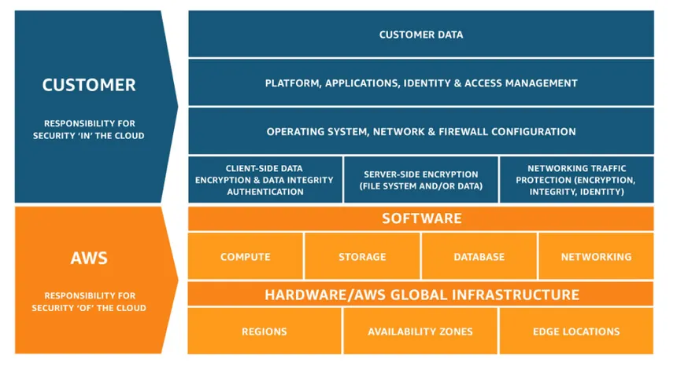

# Cloud Concepts

### On-Premises Infrastructure
On-premises infrastructure refers to physical servers, storage, and networking equipment managed within an organization's facilities. Key traits include:

- **Ownership & Control**: Full control over hardware and software.
- **High Initial Costs**: Significant upfront investment for hardware and setup.
- **Maintenance**: IT teams handle updates, security, and repairs.
- **Limited Scalability**: Scaling requires purchasing and installing new hardware.

While offering control, on-premises systems often lack flexibility and demand high maintenance efforts.

### Cloud Technology
Cloud technology provides on-demand access to computing resources via the internet. Instead of owning hardware, businesses rent resources from providers. Key features:

- **Cost Efficiency**: Pay-as-you-go pricing eliminates upfront costs.
- **Scalability**: Dynamically adjust resources based on demand.
- **Flexibility**: Access to diverse services (compute, storage, databases).
- **Global Accessibility**: Services available anywhere with internet.
- **Reliability**: High availability and disaster recovery.
- **Managed Services**: Providers handle updates, security, and maintenance.

Cloud technology enables innovation and agility, making it a preferred alternative to traditional systems.

### Types of Cloud Services
1. **Public Cloud**: Shared infrastructure managed by third-party providers (e.g., AWS, Azure, Google Cloud).
    - **Advantages**: Low upfront costs, easy scalability, no maintenance.
    - **Disadvantages**: Limited control, potential security concerns.

2. **Private Cloud**: Dedicated infrastructure for a single organization, hosted on-premises or by a provider.
    - **Advantages**: Full control, enhanced security.
    - **Disadvantages**: High costs, complex management.

3. **Hybrid Cloud**: Combines public and private clouds for flexibility and scalability.
    - **Advantages**: Optimized for sensitive workloads, better disaster recovery.
    - **Disadvantages**: Complex integration, higher costs.

4. **Multi-Cloud**: Utilizes multiple providers to avoid vendor lock-in and leverage diverse services.
    - **Advantages**: Flexibility, redundancy, access to best-in-class services.
    - **Disadvantages**: Complex management, interoperability challenges, higher costs.

## Interview Questions
1. **What is Cloud Computing?**  
    Delivery of computing services (e.g., servers, storage, databases) over the internet, eliminating the need for managing physical hardware.

2. **Key Characteristics of Cloud Computing?**  
    - On-demand self-service
    - Broad network access
    - Resource pooling
    - Rapid elasticity
    - Measured service

3. **Benefits of Cloud Computing?**  
    - Reduced IT costs(no hardware purchase)
    - Scalability
    - Flexibility
    - Performance
    - Security
    - Disaster recovery

4. **Hybrid Cloud vs. Multi-Cloud?**  
    - **Hybrid Cloud**: Combines public and on-premises private clouds for flexibility and scalability.
    - **Multi-Cloud**: Utilizes multiple cloud providers to avoid vendor lock-in and leverage diverse services and does not restrict to a single provider.

5. **What is IaaS, PaaS, SaaS?**  
    - **IaaS (Infrastructure as a Service)**: Provides virtualized computing resources over the internet (e.g., AWS EC2). Users manage the OS, applications, and data.
    - **PaaS (Platform as a Service)**: Offers hardware and software tools over the internet for application development (e.g., AWS Elastic Beanstalk, Google App Engine). Users manage applications and data, while the provider manages the OS and infrastructure, automating deployment and scaling.
    - **SaaS (Software as a Service)**: Delivers software applications over the internet on a subscription basis (e.g., Google Workspace). Users access the software via a web browser, with the provider managing everything from infrastructure to application updates.(eg. Youtube, Netflix, etc.)
    - **AWS shared responsibility:**
    

6. **Explain the concept of resource pooling in cloud computing?**  
    Resource pooling refers to the provider's ability to serve multiple customers using a multi-tenant model, dynamically assigning and reallocating resources based on demand. This allows for efficient resource utilization and cost savings.

7. **What is multi-tenancy in cloud computing?**  
    Multi-tenancy is a cloud architecture where multiple customers share the same infrastructure and applications while keeping their data isolated. This allows for efficient resource utilization and cost savings.

8. **What is the difference between vertical and horizontal scaling?**  
    - **Vertical Scaling**: Adding more power (CPU, RAM) to an existing server (scale-up).
    - **Horizontal Scaling**: Adding more servers to distribute the load (scale-out).

9. **What are some technical keywords in cloud computing?**  
    - **Scalability**: Ability to increase or decrease resources based on demand.
    - **Elasticity**: Ability to quickly scale resources up or down.
    - **Reliability**: Ability to maintain service availability and performance.
    - **Latency**: Delay in data transfer between the user and the cloud service.
