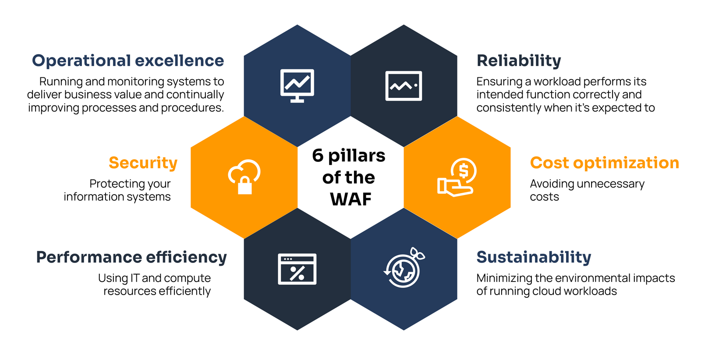

## AWS Well-Architected Framework

The **AWS Well-Architected Framework** provides best practices and design principles for building secure, high-performing, resilient, and efficient infrastructure on AWS. It is organized into **6 pillars**.

---

### 1. Operational Excellence
- **Monitoring and Logging**: Implement monitoring and logging to track system performance and detect issues.
- **Incident Response**: Establish processes for responding to incidents and outages.
- **Change Management**: Implement change management processes to ensure that changes are made systematically and with minimal disruption.
- **Backup and Recovery**: Develop backup and recovery plans to ensure data integrity and availability in case of failures.
- **Testing and Validation**: Regularly test and validate backup and recovery processes to ensure effectiveness.

### 2. Security
- **Identity and Access Management (IAM)**: Use IAM to manage user access and permissions to AWS resources.
- **Data Encryption**: Implement encryption for data at rest and in transit to protect sensitive information.
- **Network Security**: Utilize security groups and network ACLs to control inbound and outbound traffic to AWS resources.
- **Monitoring and Logging**: Implement monitoring and logging to detect security incidents and anomalies.
- **Incident Response**: Establish processes for responding to security incidents and breaches.

### 3. Reliability
- **Fault Tolerance**: Design systems to be fault-tolerant by using multiple Availability Zones and Regions.
- **Backup Solutions**: Implement robust backup solutions to ensure data can be restored in case of failure.
- **Monitoring and Alerts**: Set up monitoring and alerts to detect and respond to system failures quickly.
- **Testing Recovery Procedures**: Regularly test recovery procedures to ensure they work as intended.
- **Documentation**: Maintain clear documentation of disaster recovery plans and procedures.
- **Regular Reviews**: Conduct regular reviews of disaster recovery plans to ensure they remain effective and up-to-date.

### 4. Performance Efficiency
- **Scalability**: Design systems to scale horizontally or vertically based on demand.
- **Performance Monitoring**: Continuously monitor system performance to identify bottlenecks and optimize resource usage.
- **Resource Optimization**: Regularly review and optimize resource allocation to improve efficiency and reduce costs.

### 5. Cost Optimization
- **Resource Tagging**: Use resource tagging to track and manage costs associated with AWS resources.
- **Cost Monitoring**: Implement cost monitoring tools to analyze spending and identify cost-saving opportunities.
- **Budgeting**: Establish budgets for different AWS services to control spending and avoid unexpected costs.

### 6. Sustainability
- **Energy Efficiency**: Design systems to be energy-efficient by optimizing resource usage and minimizing waste.
- **Sustainable Practices**: Implement practices that reduce environmental impact, such as using renewable energy sources and optimizing data center operations.
