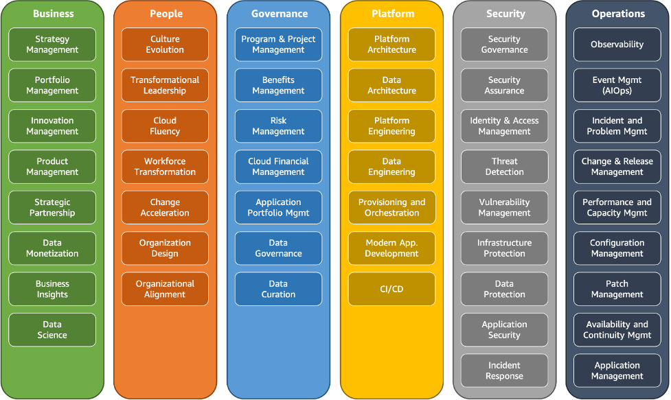
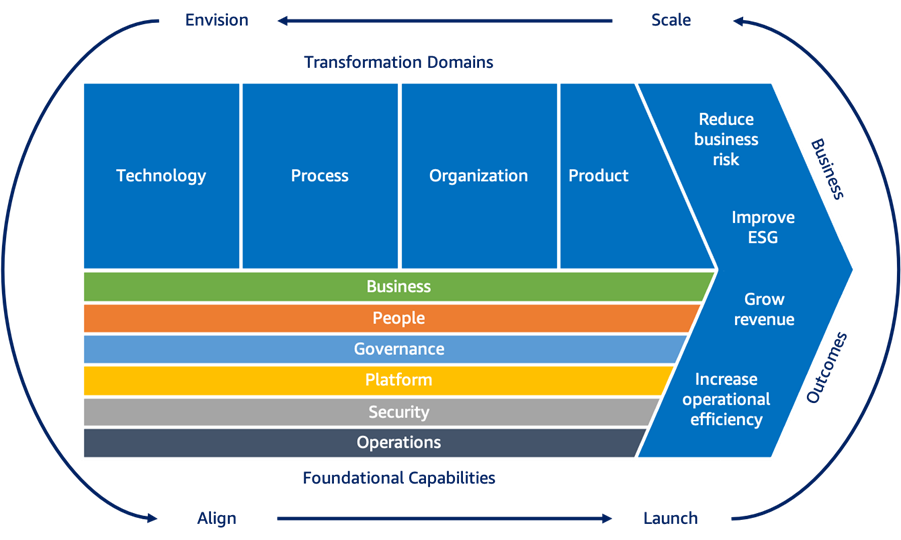

## AWS CAF (Cloud Adoption Framework)

AWS CAF is a framework that provides guidance and best practices for organizations to adopt cloud computing effectively. It helps organizations align their cloud adoption strategy with business goals and objectives.

### 6 Perspectives of AWS CAF:
- **Business**
- **People**
- **Governance**
- **Platform**
- **Security**
- **Operations**

---

1. **Business**: Focuses on aligning cloud adoption with business goals and objectives. The Business Perspective is about justifying the investment. Envision helps organizations understand the business value of cloud adoption and how it can drive innovation and growth.
   - **Key Areas**: Business case development, financial management, and stakeholder engagement.
   - **Example**: Developing a business case for migrating to AWS to reduce costs and improve agility.

2. **People**: Focuses on the human aspect of cloud adoption, including skills development and organizational change management.
   - **Key Areas**: Skills development, change management, and organizational culture.
   - **Example**: Providing training for employees to develop cloud skills and foster a cloud-first culture.

3. **Governance**: Focuses on establishing policies, processes, and controls to manage cloud resources effectively.
   - **Key Areas**: Compliance, risk management, and resource management.
   - **Example**: Implementing policies for data governance and compliance with industry regulations.

4. **Security**: Focuses on protecting cloud resources and data through various security measures.
   - **Key Areas**: Identity management, data protection, and threat detection.
   - **Example**: Implementing multi-factor authentication and encryption for sensitive data.

5. **Platform**: Focuses on the technical aspects of cloud adoption, including architecture, design, and deployment.
   - **Key Areas**: Architecture design, application development, and deployment automation.
   - **Example**: Designing a microservices architecture for a cloud-native application using AWS services.

6. **Operations**: Focuses on the operational aspects of cloud adoption, including monitoring, incident response, and change management.
   - **Key Areas**: Monitoring, incident response, and change management.
   - **Example**: Implementing monitoring and alerting for cloud resources to detect and respond to incidents quickly.
