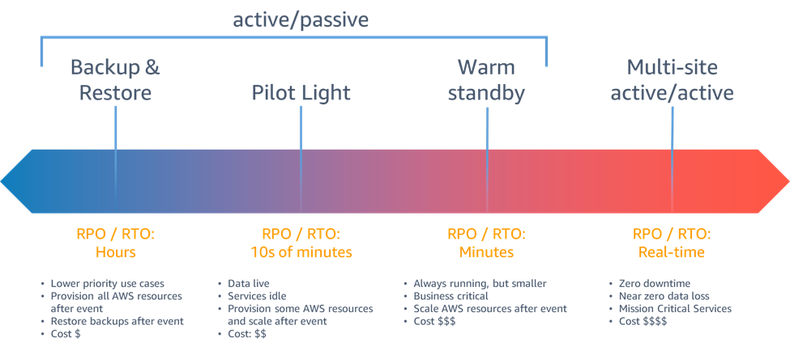

## AWS Disaster Recovery (DR)

**Disaster Recovery** is the process of restoring systems, data, and operations after an unplanned failure — hardware fault, region outage, accidental deletion, ransomware, etc.

Two metrics define every DR strategy:

**RPO (Recovery Point Objective)** — how much data loss is acceptable, measured in time.
> "If a disaster happens right now, how old can the restored data be?"
> RPO = 1 hour → you can lose at most 1 hour of data → backups must run at least every hour.

**RTO (Recovery Time Objective)** — how long the system can be down before it must be restored.
> "How much downtime is acceptable?"
> RTO = 30 minutes → the system must be back up within 30 minutes of a disaster.

```
Last backup          Disaster          System restored
     │                   │                   │
─────┼───────────────────┼───────────────────┼─────►
     │◄──── RPO ────────►│◄───── RTO ───────►│
     (data loss window)       (downtime window)
```

Lower RPO + Lower RTO = faster, safer recovery = higher cost.

---

## The 4 DR Strategies

### 1. Backup and Restore

Regularly snapshot data and AMIs to S3 (or cross-region S3). On disaster — provision fresh infrastructure and restore from backup. Nothing runs in the DR region until a disaster occurs.

```
Primary Region (active)          DR Region (nothing running)
  EC2 + RDS (live)     ──────►  S3 bucket (snapshots, AMIs)
                        backup
                        
On disaster:
  S3 snapshots ──► Launch new EC2 from AMI
                ──► Restore RDS from snapshot
                ──► Update Route 53 DNS
```

- **RPO**: Hours (depends on backup frequency)
- **RTO**: Hours (time to provision + restore)
- **Cost**: $ — pay only for S3 storage of backups
- **Best for**: Non-critical systems, dev/test environments

---

### 2. Pilot Light

Core infrastructure (typically the database) runs continuously in the DR region — replicating live data. Everything else (app servers, load balancers) is provisioned only when disaster strikes.

The "pilot light" analogy: a small flame is always burning, ready to ignite the full system quickly.

```
Primary Region (active)          DR Region (minimal)
  EC2 fleet                        ← nothing
  ALB                              ← nothing
  RDS (primary) ──replication──►  RDS replica (running, small)

On disaster:
  Promote RDS replica → primary
  Launch EC2 fleet from pre-built AMIs
  Point Route 53 → DR region ALB
```

- **RPO**: Minutes (replication lag)
- **RTO**: Tens of minutes (spin up app tier)
- **Cost**: $$ — only DB replica runs continuously
- **Best for**: Apps needing faster recovery, can tolerate brief spin-up time

---

### 3. Warm Standby

A fully functional but **scaled-down** copy of production runs in the DR region at all times — smaller EC2 instances, fewer servers, smaller DB. On disaster, scale it up to full production size.

```
Primary Region (full capacity)    DR Region (scaled-down, always running)
  10× EC2 (large)   ────────►    2× EC2 (small)
  RDS db.r5.4xlarge ────────►    RDS db.r5.large  (replica, promoting on DR)
  ALB               ────────►    ALB (live, minimal traffic)
  
On disaster:
  Scale EC2 Auto Scaling group 2 → 10
  Resize RDS to db.r5.4xlarge
  Route 53 health check auto-fails over
```

- **RPO**: Seconds (continuous replication)
- **RTO**: Minutes (scale-up, no provisioning from scratch)
- **Cost**: $$$ — full stack always running at ~20–30% capacity
- **Best for**: Business-critical apps needing fast, mostly-automated recovery

---

### 4. Multi-Site Active-Active

Full production capacity runs in **two or more regions simultaneously**. Traffic is split across all regions (Route 53 / Global Accelerator). On disaster, the remaining region absorbs 100% of traffic automatically — no manual steps, no failover lag.

```
Users
  │
  ├──► Route 53 (latency/weighted routing)
  │         │                    │
  │    us-east-1             eu-west-1
  │  (full capacity)       (full capacity)
  │   EC2 + Aurora  ◄────►  EC2 + Aurora Global DB
  │                  sync         (< 1s replication lag)

On disaster (us-east-1 fails):
  Route 53 health check detects failure
  100% traffic → eu-west-1 automatically
  Aurora replica promotes to primary
  RTO: seconds, RPO: near zero
```

- **RPO**: Near zero (< 1 second with Aurora Global DB)
- **RTO**: Near zero (seconds — automatic failover)
- **Cost**: $$$$ — full infrastructure cost × number of regions
- **Best for**: Mission-critical, zero-downtime applications (banking, e-commerce)

---

## Strategy Comparison

| Strategy | RPO | RTO | Cost | What runs in DR region | AWS Services |
|---|---|---|---|---|---|
| **Backup & Restore** | Hours | Hours | $ | Nothing — restore from scratch | S3, AMI snapshots, RDS snapshots |
| **Pilot Light** | Minutes | 10s of minutes | $$ | DB replica only | RDS replica, Route 53, Auto Scaling |
| **Warm Standby** | Seconds | Minutes | $$$ | Full stack at reduced capacity | Route 53 health checks, Auto Scaling |
| **Multi-Site Active-Active** | Near zero | Near zero | $$$$ | Full stack at full capacity | Aurora Global DB, Route 53, Global Accelerator |



---

## AWS Elastic Disaster Recovery (DRS)

**AWS Elastic Disaster Recovery (DRS)** is a fully managed service that continuously replicates your source servers (on-premises, other cloud, or another AWS region) into AWS — so you can launch recovery instances in minutes when disaster strikes.

- Formerly known as **CloudEndure Disaster Recovery**.
- Works for **any application, any OS, any database** — not tied to specific AWS services.
- **RPO: seconds** (continuous block-level replication), **RTO: minutes** (pre-staged recovery instances).
- Fits between **Pilot Light** and **Warm Standby** on the cost/speed spectrum.

---

### How It Works

```
Source Servers (on-premises / other cloud / AWS region)
    │
    │  Replication Agent (lightweight, installed on source)
    │  continuously replicates block-level disk changes
    ▼
Staging Area (low-cost EBS volumes in target AWS region)
    │  stores replicated data — small EC2 replication servers
    │  (cheap — not production-sized instances)
    ▼
On failover (drill or real disaster):
    │  DRS launches Recovery Instances from staging area
    │  using pre-configured Launch Templates
    ▼
Recovery Instances (full-size EC2 in target region)
    └──► production traffic redirected here via Route 53
```

The staging area runs cheap 24/7 — recovery instances are only launched during a drill or actual failover.

---

### Key Concepts

- **Replication Agent** — installed on each source server. Captures block-level disk changes and sends them to the staging area continuously.
- **Staging Area** — lightweight EC2 + low-cost EBS in the target region. Holds a copy of all replicated disks. Not accessible to end users — only used to launch recovery instances.
- **Launch Template** — pre-configured settings (instance type, subnet, security groups, tags) for each recovery instance — so DRS knows exactly what to launch on failover.
- **Recovery Drill** — test failover without affecting production. Launches recovery instances in an isolated environment to verify they work.
- **Failback** — after failing over to AWS, DRS can replicate changes back to the original source and fail back to on-premises once it's restored.

---

### Failover Flow

```
Normal state:
  Source server ──► Replication Agent ──► Staging Area (cheap, always running)

Disaster detected:
  1. Trigger failover in DRS console (or automated via CloudWatch alarm)
  2. DRS converts staging disks → recovery instance volumes
  3. Recovery instances launch using Launch Templates
  4. Update Route 53 / load balancer → point to recovery instances
  5. Applications resume in AWS  (RTO: minutes)

After source is restored (failback):
  1. DRS replicates changes from AWS back to on-premises
  2. Cutover back to on-premises when ready
```

---

### DRS vs Manual DR Strategies

| | AWS Elastic DRS | Pilot Light | Warm Standby |
|---|---|---|---|
| **Replication** | Continuous block-level (agent) | DB-level (RDS replica) | Full stack replication |
| **What runs 24/7** | Staging area only (cheap) | DB replica only | Scaled-down full stack |
| **RPO** | Seconds | Minutes | Seconds |
| **RTO** | Minutes | Tens of minutes | Minutes |
| **Works for** | Any OS, any app, any DB | AWS-native workloads | AWS-native workloads |
| **On-premises support** | Yes — primary use case | No | No |
| **Failback** | Built-in | Manual | Manual |
| **Cost** | Low (staging area only) | Low | Medium |
