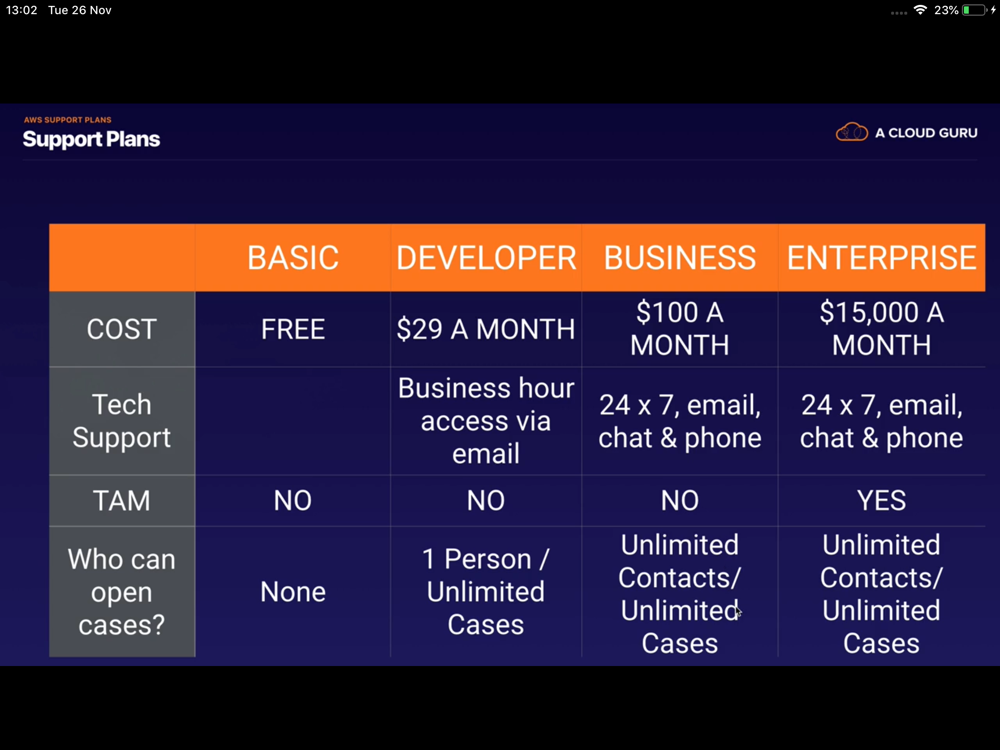
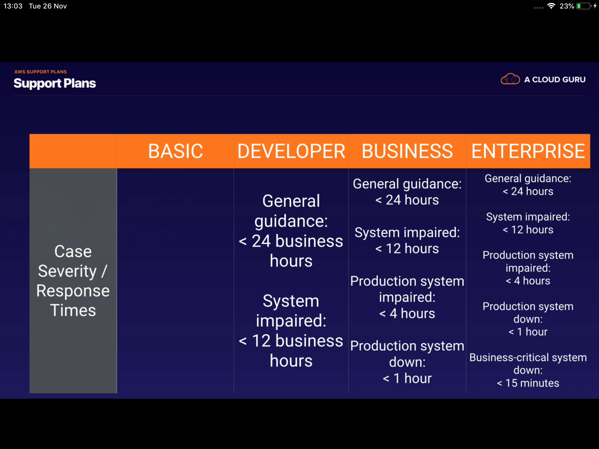

## AWS Support Plans

AWS offers five support plans. Cost order: **Basic < Developer < Business < Enterprise On-Ramp < Enterprise**

---

### 1. Basic Support
- Included with all AWS accounts at **no additional cost**.
- **Features**:
  - 24/7 access to customer service
  - Access to AWS documentation, whitepapers, and support forums
  - AWS Trusted Advisor (basic checks only)
  - AWS Personal Health Dashboard
  - No technical support

### 2. Developer Support
- Designed for developers experimenting with AWS or building applications.
- **Features**:
  - All Basic Support features
  - Technical support via email (business hours)
  - Access to AWS Trusted Advisor (full checks)
  - Best practice guidance
  - General architectural guidance
  - No access to AWS Support API

### 3. Business Support
- Designed for production workloads — 24/7 technical support.
- **Features**:
  - All Developer Support features
  - 24/7 technical support via email, chat, and phone
  - Access to AWS Support API (programmatic access)
  - Infrastructure event management
  - Proactive guidance and best practices
  - Access to AWS Well-Architected Tool
  - Access to AWS Trusted Advisor (full checks)
  - Access to AWS Support Concierge (billing and account management)

### 4. Enterprise On-Ramp Support
- Designed for organizations new to AWS that need help getting started.
- **Features**:
  - Access to a pool of Technical Account Managers (TAM)
  - Proactive guidance and best practices
  - 24/7 technical support via email, chat, and phone
  - Access to AWS Well-Architected Tool
  - Access to AWS Trusted Advisor (full checks)

### 5. Enterprise Support
- Designed for large organizations with mission-critical applications.
- **Features**:
  - All Business Support features
  - 24/7 technical support via email, chat, and phone
  - Dedicated Technical Account Manager (TAM)
  - Infrastructure event management
  - Access to AWS Support API (programmatic access)
  - Proactive guidance and best practices
  - Access to AWS Well-Architected Tool
  - Access to AWS Trusted Advisor (full checks)
  - Access to AWS Support Concierge (billing and account management)
