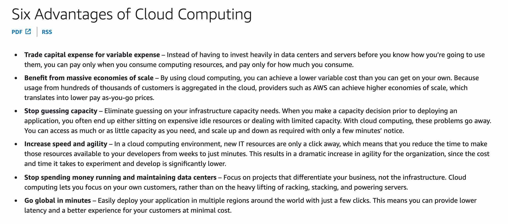
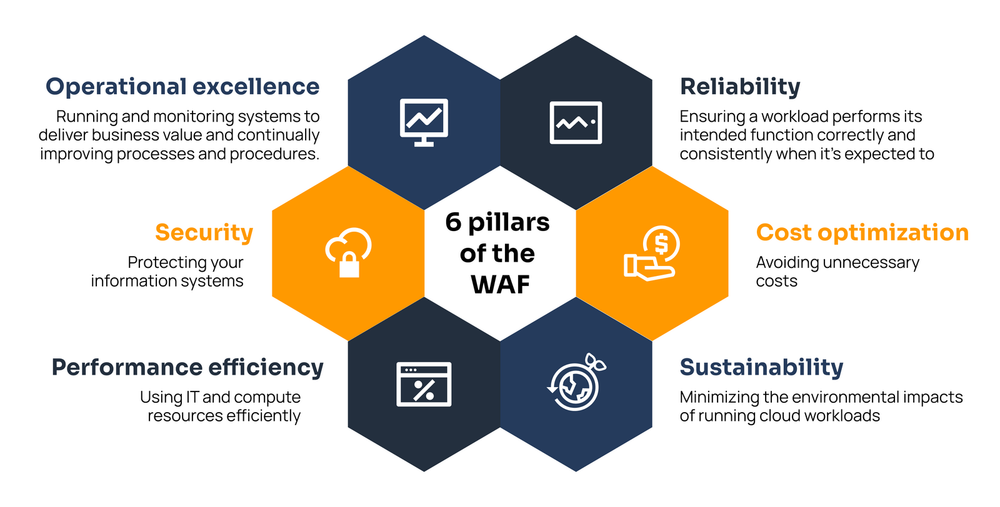
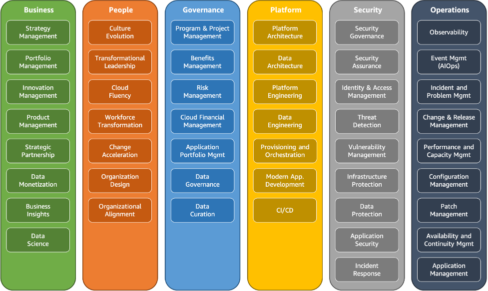
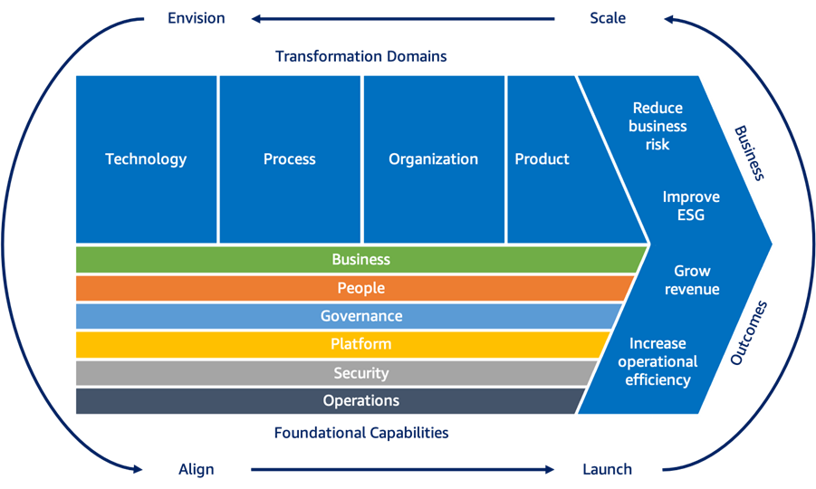
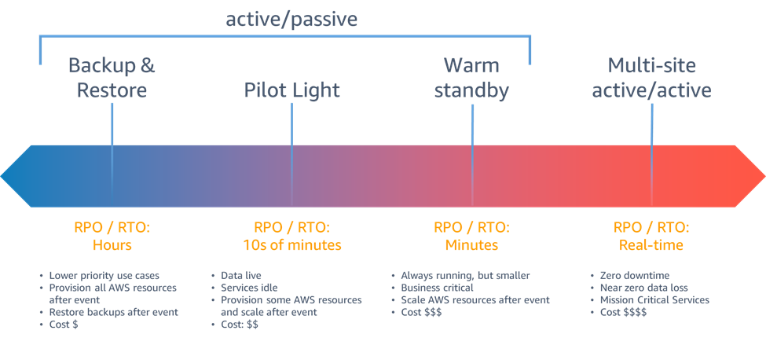
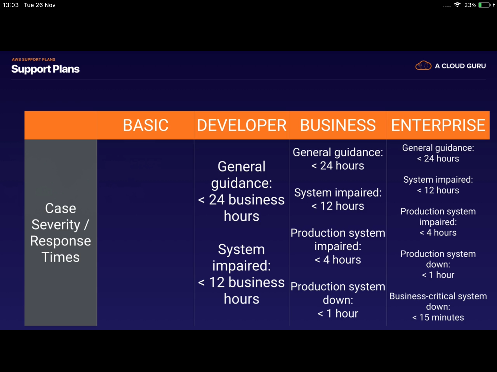

# AWS Cloud Architecture

**AWS Cloud Architecture** refers to the design and structure of applications, services, and systems built using Amazon Web Services. It is designed to provide **scalable**, **elastic**, and **highly available** solutions for modern applications. By following best practices, it ensures **reliability**, **performance**, and **cost-efficiency**.

## 6 Advantages of AWS Cloud Architecture:

## AWS Well-Architected Framework
#### 1. **Operational Excellence**
#### 2. **Security**
#### 3. **Reliability**
#### 4. **Performance Efficiency**
#### 5. **Cost Optimization**
#### 6. **Sustainability**

### 1. **Operational Excellence:**
- **Monitoring and Logging**: Implement monitoring and logging to track system performance and detect issues.
- **Incident Response**: Establish processes for responding to incidents and outages.
- **Change Management**: Implement change management processes to ensure that changes are made systematically and with minimal disruption.
- **Backup and Recovery**: Develop backup and recovery plans to ensure data integrity and availability in case of failures.
- **Testing and Validation**: Regularly test and validate backup and recovery processes to ensure effectiveness.

### 2. **Security:**
- **Identity and Access Management (IAM)**: Use IAM to manage user access and permissions to AWS resources.
- **Data Encryption**: Implement encryption for data at rest and in transit to protect sensitive information.
- **Network Security**: Utilize security groups and network ACLs to control inbound and outbound traffic to AWS resources.
- **Monitoring and Logging**: Implement monitoring and logging to detect security incidents and anomalies.
- **Incident Response**: Establish processes for responding to security incidents and breaches.

### 3. **Reliability:**
- **Fault Tolerance**: Design systems to be fault-tolerant by using multiple Availability Zones and Regions.
- **Backup Solutions**: Implement robust backup solutions to ensure data can be restored in case of failure.
- **Monitoring and Alerts**: Set up monitoring and alerts to detect and respond to system failures quickly.
- **Testing Recovery Procedures**: Regularly test recovery procedures to ensure they work as intended.
- **Documentation**: Maintain clear documentation of disaster recovery plans and procedures.
- **Regular Reviews**: Conduct regular reviews of disaster recovery plans to ensure they remain effective and up-to-date. 

### 4. **Performance Efficiency:**
- **Scalability**: Design systems to scale horizontally or vertically based on demand.
- **Performance Monitoring**: Continuously monitor system performance to identify bottlenecks and optimize resource usage.
- **Resource Optimization**: Regularly review and optimize resource allocation to improve efficiency and reduce costs.

### 5. **Cost Optimization:**
- **Resource Tagging**: Use resource tagging to track and manage costs associated with AWS resources.
- **Cost Monitoring**: Implement cost monitoring tools to analyze spending and identify cost-saving opportunities.
- **Budgeting**: Establish budgets for different AWS services to control spending and avoid unexpected costs.

### 6. **Sustainability:**
- **Energy Efficiency**: Design systems to be energy-efficient by optimizing resource usage and minimizing waste.
- **Sustainable Practices**: Implement practices that reduce environmental impact, such as using renewable energy sources and optimizing data center operations.

## AWS CAF (Cloud Adoption Framework)
AWS CAF is a framework that provides guidance and best practices for organizations to adopt cloud computing effectively. It helps organizations align their cloud adoption strategy with business goals and objectives.

### 6 perspectives of AWS CAF:
- **Business**
- **People**
- **Governance**
- **Platform**
- **Security**
- **Operations**

1. **Business**: Focuses on aligning cloud adoption with business goals and objectives. The Business Perspective is about justifying the investment. Envision helps organizations understand the business value of cloud adoption and how it can drive innovation and growth.
   - **Key Areas**: Business case development, financial management, and stakeholder engagement.
   - **Example**: Developing a business case for migrating to AWS to reduce costs and improve agility.
2. **People**: Focuses on the human aspect of cloud adoption, including skills development and organizational change management.
   - **Key Areas**: Skills development, change management, and organizational culture.
   - **Example**: Providing training for employees to develop cloud skills and foster a cloud-first culture.
3. **Governance**: Focuses on establishing policies, processes, and controls to manage cloud resources effectively.
   - **Key Areas**: Compliance, risk management, and resource management.
   - **Example**: Implementing policies for data governance and compliance with industry regulations.
4. **Security**: Focuses on protecting cloud resources and data through various security measures.
   - **Key Areas**: Identity management, data protection, and threat detection.
   - **Example**: Implementing multi-factor authentication and encryption for sensitive data.
5. **Platform**: Focuses on the technical aspects of cloud adoption, including architecture, design, and deployment.
   - **Key Areas**: Architecture design, application development, and deployment automation.
   - **Example**: Designing a microservices architecture for a cloud-native application using AWS services.
6. **Operations**: Focuses on the operational aspects of cloud adoption, including monitoring, incident response, and change management.
   - **Key Areas**: Monitoring, incident response, and change management.
   - **Example**: Implementing monitoring and alerting for cloud resources to detect and respond to incidents quickly.

## AWS Disaster Recovery Strategies
#### 1. **Backup and Restore**
#### 2. **Pilot Light**
#### 3. **Warm Standby**
#### 4. **Multi-Site**

#### RPO (Recovery Point Objective): The maximum acceptable amount of data loss measured in time.
#### RTO (Recovery Time Objective): The maximum acceptable amount of time to restore the system after a disaster.

#### 1. **Backup and Restore:**
- **Description**: This strategy involves regularly backing up data and applications to a separate location. In the event of a disaster, the data can be restored to a new environment.
- **Use Case**: Suitable for non-critical applications where downtime is acceptable, and data loss can be tolerated.
- **Advantages**: Cost-effective, simple to implement, and easy to manage.
- **Disadvantages**: Longer recovery time, potential data loss, and requires manual intervention for recovery.
- **Example**: Backing up data to Amazon S3 and restoring it to a new EC2 instance in case of failure.

#### 2. **Pilot Light:**
- **Description**: This strategy involves maintaining a minimal version of the environment running in the cloud. In the event of a disaster, the environment can be scaled up to full capacity.
- **Use Case**: Suitable for applications that require a quick recovery time but can tolerate some downtime.
- **Advantages**: Faster recovery time compared to backup and restore, lower costs than a fully active environment.
- **Disadvantages**: Requires some manual intervention to scale up the environment, and may not be suitable for all applications.
- **Example**: Running a minimal version of a web application in AWS and scaling it up in case of a disaster.

#### 3. **Warm Standby:**
- **Description**: This strategy involves maintaining a scaled-down version of the environment running in the cloud. In the event of a disaster, the environment can be quickly scaled up to full capacity.
- **Use Case**: Suitable for applications that require a quick recovery time and can tolerate some downtime.
- **Advantages**: Faster recovery time compared to pilot light, lower costs than a fully active environment.
- **Disadvantages**: Requires some manual intervention to scale up the environment, and may not be suitable for all applications.
- **Example**: Running a scaled-down version of a web application in AWS and scaling it up in case of a disaster.

#### 4. **Multi-Site:**
- **Description**: This strategy involves running multiple active environments in different locations. In the event of a disaster, traffic can be redirected to the other environment.
- **Use Case**: Suitable for mission-critical applications that require high availability and minimal downtime.
- **Advantages**: Minimal downtime, high availability, and automatic failover.
- **Disadvantages**: Higher costs, complex architecture, and requires careful planning and management.
- **Example**: Running a web application in multiple AWS Regions and redirecting traffic to the other Region in case of a disaster.

## HIPAA (Health Insurance Portability and Accountability Act)
AWS provides a HIPAA-compliant environment for healthcare organizations to store and process protected health information (PHI). AWS customers can use AWS services to build HIPAA-compliant applications.
### AWS HIPAA Compliance:
- **Business Associate Agreement (BAA)**: AWS offers a BAA to customers who need to comply with HIPAA regulations.
- **HIPAA-Eligible Services**: AWS provides a list of services that are eligible for HIPAA compliance. These services are designed to meet the security and privacy requirements of HIPAA, including:
  - Amazon EC2
  - Amazon S3
  - Amazon RDS
  - Amazon Redshift
  - Amazon EMR
  - AWS Lambda
  - AWS Glue
  - Amazon API Gateway
  - Amazon CloudFront
  - AWS Direct Connect
  - AWS Artifact Registry
- **Data Encryption**: AWS provides encryption options for data at rest and in transit to protect PHI.

## AWS Support Plans
AWS offers four support plans to meet the needs of different customers. Each plan provides varying levels of support, including technical assistance, account management, and access to AWS resources.

**Cost Order: Basic < Developer < Business < Enterprise On-Ramp < Enterprise**
### 1. **Basic Support:**
- **Description**: Basic Support is included with all AWS accounts at no additional cost. It provides access to AWS resources, documentation, and support forums.
- **Features**:
  - 24/7 access to customer service
  - Access to AWS documentation, whitepapers, and support forums
  - AWS Trusted Advisor (basic checks)
  - AWS Personal Health Dashboard
  - No technical support

### 2. **Developer Support:**
- **Description**: Developer Support is designed for developers and provides technical support for AWS services. It is suitable for customers who are experimenting with AWS or building applications.
- **Features**:
  - All Basic Support features
  - Technical support via email (business hours)
  - Access to AWS Trusted Advisor (full checks)
  - Best practice guidance
  - General architectural guidance
  - No access to AWS Support API

### 3. **Business Support:**
- **Description**: Business Support is designed for production workloads and provides 24/7 technical support. It is suitable for customers with mission-critical applications.
- **Features**:
  - All Developer Support features
  - 24/7 technical support via email, chat, and phone
  - Access to AWS Support API
  - Infrastructure event management
  - Proactive guidance and best practices
  - Access to AWS Well-Architected Tool
  - Access to AWS Trusted Advisor (full checks)
  - Access to AWS Support Concierge (billing and account management)

### 4. **Enterprise Support:**
- **Description**: Enterprise Support is designed for large organizations with mission-critical applications. It provides 24/7 technical support and a dedicated Technical Account Manager (TAM).
- **Features**:
  - All Business Support features
  - 24/7 technical support via email, chat, and phone
  - Dedicated Technical Account Manager (TAM)
  - Infrastructure event management
  - Proactive guidance and best practices
  - Access to AWS Well-Architected Tool
  - Access to AWS Trusted Advisor (full checks)
  - Access to AWS Support Concierge (billing and account management)

### 5. **Enterprise On-Ramp Support:**
- **Description**: Enterprise On-Ramp Support is designed for organizations that are new to AWS and need help getting started. It provides access to a dedicated Technical Account Manager (TAM) and proactive guidance.
- **Features**:
  - Access to a dedicated Technical Account Manager (TAM)
  - Proactive guidance and best practices
  - 24/7 technical support via email, chat, and phone
  - Access to AWS Well-Architected Tool
  - Access to AWS Trusted Advisor (full checks)

## AWS Connect
AWS Connect is a cloud-based contact center service that enables organizations to provide customer service and support. It is designed to be easy to set up and use, allowing businesses to create a contact center in minutes. It offers features such as automatic call distribution, interactive voice response, and real-time analytics to enhance customer interactions and improve service efficiency. Additionally, it integrates seamlessly with other AWS services to provide a comprehensive solution for customer engagement.