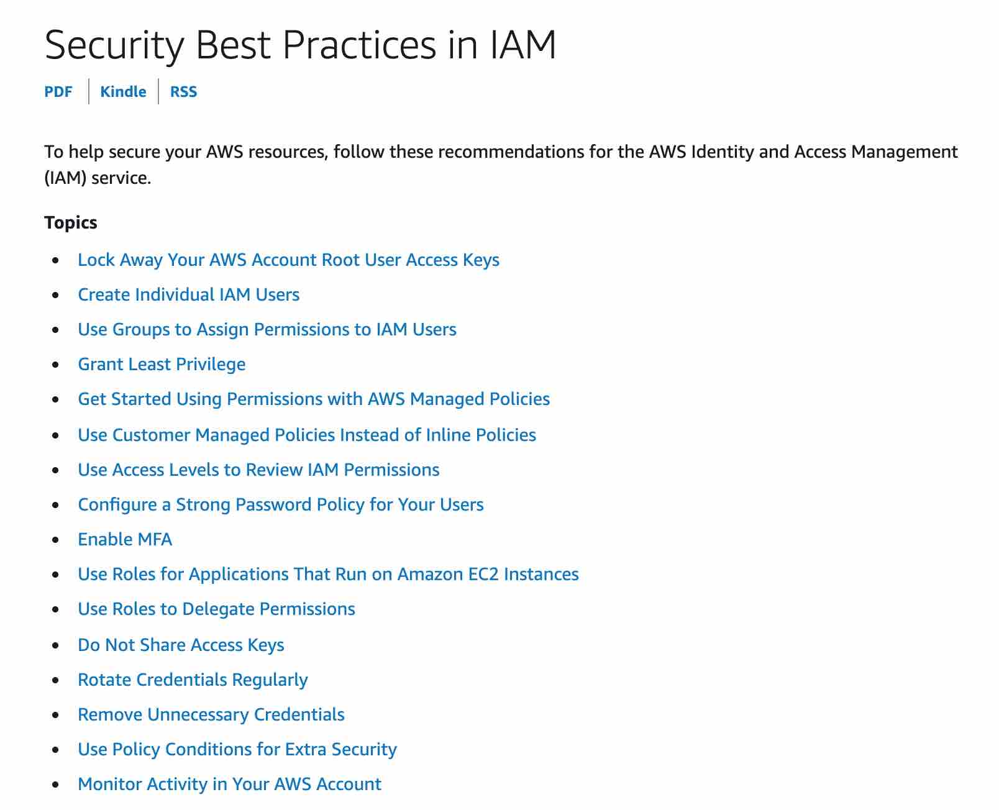

## IAM (Identity and Access Management) in AWS
IAM is a web service that helps you securely control access to AWS services and resources for your users/employees in your organization. IAM enables you to manage permissions and access rights for AWS resources, ensuring that only authorized users can perform specific actions.

| # | Topic | Description |
|---|-------|-------------|
| 01 | [IAM Users & Groups](./01-IAM-Users-Groups/README.md) | User identities, credentials, and group-based permission management |
| 02 | [IAM Policies](./02-IAM-Policies/README.md) | Policy types, structure, PrincipalOrgID, and permission boundaries |
| 03 | [IAM Roles](./03-IAM-Roles/README.md) | Role assumption, cross-account access, roles vs resource-based policies |
| 04 | [Permission Evaluation Logic](./04-IAM-Permission-Evaluation/README.md) | How AWS evaluates allow/deny across all policy layers |
| 05 | [Root Account](./05-Root-Account/README.md) | Root account privileges and best practices |
| 06 | [IAM Identity Center](./06-IAM-Identity-Center/README.md) | SSO, identity sources, Active Directory types, permission sets |
| 07 | [AWS Organizations](./07-AWS-Organizations/README.md) | Multi-account management, SCPs, tag policies, consolidated billing |
| 08 | [AWS Control Tower](./08-AWS-Control-Tower/README.md) | Landing zone, account factory, guardrails, reserved accounts |
