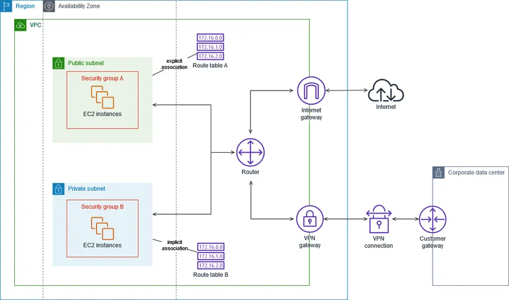

## Route Tables

A **route table** is a set of rules (routes) that determines where network traffic is directed within a VPC. This tells the routers where to send traffic based on the destination IP address.

- Every subnet must be associated with exactly **one route table**.
- A route table can be associated with **multiple subnets**.
- Every VPC has a **Main Route Table** created automatically — used by any subnet not explicitly associated with a custom table.

---

## How a Route Works

Each route has two parts:

```
Destination        Target
─────────────────────────────────────────
10.0.0.0/16    →   local          (traffic within VPC stays inside)
0.0.0.0/0      →   igw-xxxxxxxx  (everything else goes to internet)
```

- **Destination** — the CIDR range the rule matches
- **Target** — where to send the traffic (IGW, NAT Gateway, VPC Peering, etc.)
- The most **specific** (longest prefix) route wins when multiple rules match.

---

## Public vs Private Subnet Routing

**Public subnet route table:**
```
Destination     Target
10.0.0.0/16  →  local            ← VPC-internal traffic
0.0.0.0/0    →  igw-xxxxxxxx     ← everything else → internet
```

**Private subnet route table:**
```
Destination     Target
10.0.0.0/16  →  local            ← VPC-internal traffic
0.0.0.0/0    →  nat-xxxxxxxx     ← outbound only → NAT Gateway (in public subnet)
```

A subnet is **public** not because of its name — but because its route table has `0.0.0.0/0 → IGW`.



---

## Common Route Targets

| Target | Used for |
|--------|----------|
| `local` | Traffic within the VPC (always present, cannot be deleted) |
| `igw-xxx` | Public internet access (Internet Gateway) |
| `nat-xxx` | Outbound-only internet from private subnets (NAT Gateway) |
| `pcx-xxx` | Traffic to a peered VPC (VPC Peering connection) |
| `vpce-xxx` | Traffic to a VPC Endpoint (S3, DynamoDB, etc.) |
| `vgw-xxx` | Traffic to on-premises via VPN (Virtual Private Gateway) |
