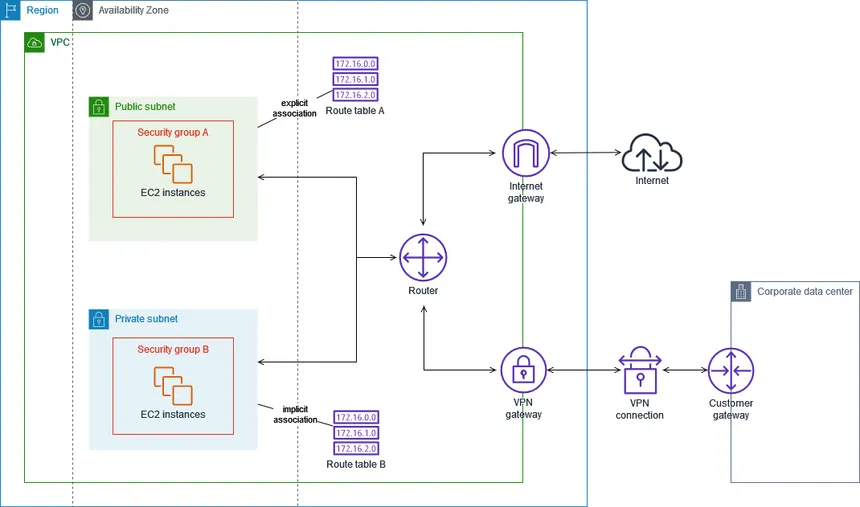
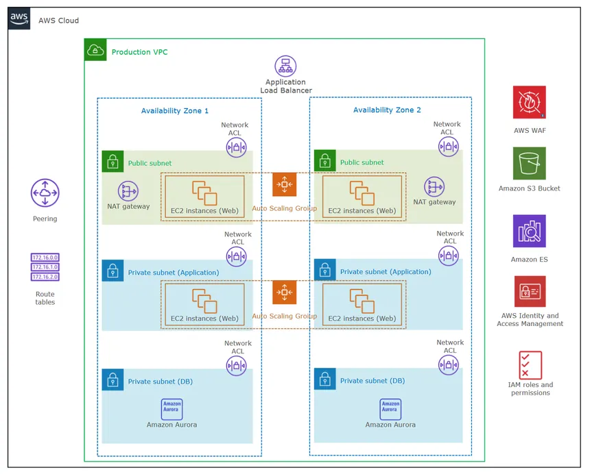

## AWS VPC (Virtual Private Cloud)

- A Virtual Private Cloud (VPC) is a secure and isolated network that you can create within the AWS cloud. It allows you to define your own network topology and complete control over it, including IP address ranges, subnets, route tables, and network gateways.
- You can launch AWS resources, such as EC2 instances, RDS databases, and Lambda functions, within your VPC.
- VPC contains list of IP addresses and it can be divided into subnets.

### Key features of VPC include:
- **Subnets**
- **Internet Gateway**
- **Route Tables**
- **NAT Gateway**
- **Security Groups**
- **Network ACLs (Access Control Lists)**
- **VPC Peering**
- **VPC Endpoints**

1. **Subnets**:
    - Subnets are segments of a VPC's IP address range where you can place groups of isolated resources. You can create public and private subnets within your VPC.
    - Public subnets have direct access to the internet, while private subnets do not and can only access the internet through a NAT gateway or instance in public subnets.
    - Subnets are defined by CIDR (Classless Inter-Domain Routing) blocks, which specify the range of IP addresses available in that subnet.
    - Each subnet must reside within a single Availability Zone (AZ), but a VPC can span multiple AZs.

2. **Internet Gateway**:
    - An Internet Gateway is a horizontally scaled, redundant, and highly available VPC component that allows communication between instances in your VPC and the internet.
    - Internet Gateways allow instances with public IP addresses to connect to the internet and receive incoming traffic from the internet.
    - It serves two purposes: to provide a target in your VPC route tables for internet-routable traffic and to perform network address translation (NAT) for instances that have been assigned public IP addresses.

3. **Route Tables**:
    - Route tables are used to control the routing of traffic within your VPC and between your VPC and the internet.(allowing the traffic from internet to subnet and from subnet to internet)
    - Each subnet in your VPC must be associated with a route table, which contains a set of rules (routes) that determine where network traffic is directed.
    - You can create custom route tables to define specific routing behavior for different subnets.
    - Example: 
    - Public subnet: The traffic is routed from subnet to internet gateway and from IG to internet using route table. Allowing the traffic from internet to subnet.
    - Private subnet: The traffic is routed from subnet to NAT gateway and from NAT gateway to internet using route table. Preventing the traffic from internet to subnet.
    

4. **NAT Gateway**:
    - A NAT (Network Address Translation) Gateway allows instances in a private subnet to initiate outbound traffic to the internet while preventing inbound traffic from the internet.
    - NAT Gateways are used to enable internet access for resources in private subnets without exposing them directly to the internet.
    - NAT Gateways changes the IP address of the instances in the private subnet to the NAT Gateway's public IP address when they access the internet.

5. **Security Groups**:
    - Security Groups are virtual firewalls that control inbound and outbound traffic to AWS resources within a VPC.
    - **They operate at the instance level (eg: EC2) and are stateful**, meaning that if you allow an incoming request, the response is automatically allowed regardless of outbound rules.
    - You can define rules based on IP addresses, protocols, and port ranges to control access to your instances.
    - Even if you allow the traffic from internet to subnet using route table/NACL, security group will block the traffic if it is not allowed in security group.
    - Also, if allowed in security group and not allowed in route table/NACL, the traffic will be blocked.

6. **Network ACLs (Access Control Lists)**:
    - Network ACLs are stateless firewalls that control inbound and outbound traffic at the subnet level.
    - **They operate at the subnet level and are stateless**, meaning that if you allow an incoming request, the response must also be explicitly allowed by a separate rule.
    - You can define rules based on IP addresses, protocols, and port ranges to control access to your subnets.
    - Network ACLs are evaluated before security groups, so they can be used to provide an additional layer of security.

7. **VPC Peering**:
    - VPC Peering allows you to connect two VPCs, enabling resources in both VPCs to communicate with each other as if they were within the same network.
    - VPC Peering can be established between VPCs in the same AWS account or different AWS accounts, and it can span multiple regions (inter-region peering).
    - Peered VPCs can be in different AWS accounts or regions, but they **must not have overlapping CIDR blocks.**
    - VPC Peering is useful for sharing resources, such as databases or applications, between different VPCs.

8. **VPC Endpoints**:
    - VPC Endpoints allow you to privately connect your VPC to supported AWS services and VPC endpoint services powered by PrivateLink without requiring an internet gateway, NAT device, VPN connection, or AWS Direct Connect connection.
    - VPC Endpoints are used to access AWS services securely and privately from within your VPC without exposing traffic to the public internet.
    - There are two types of VPC Endpoints: Interface Endpoints (for AWS services) and Gateway Endpoints (for S3 and DynamoDB).

    