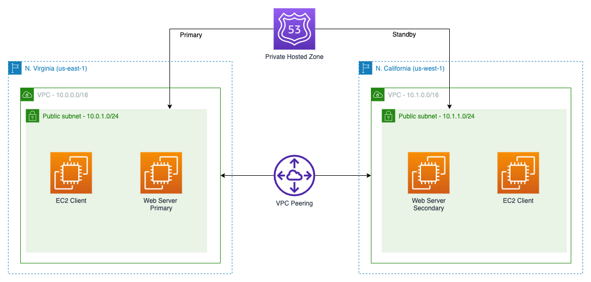
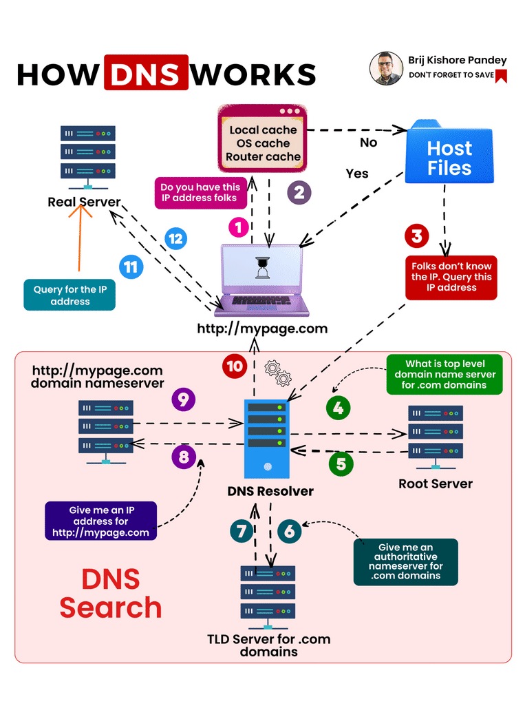
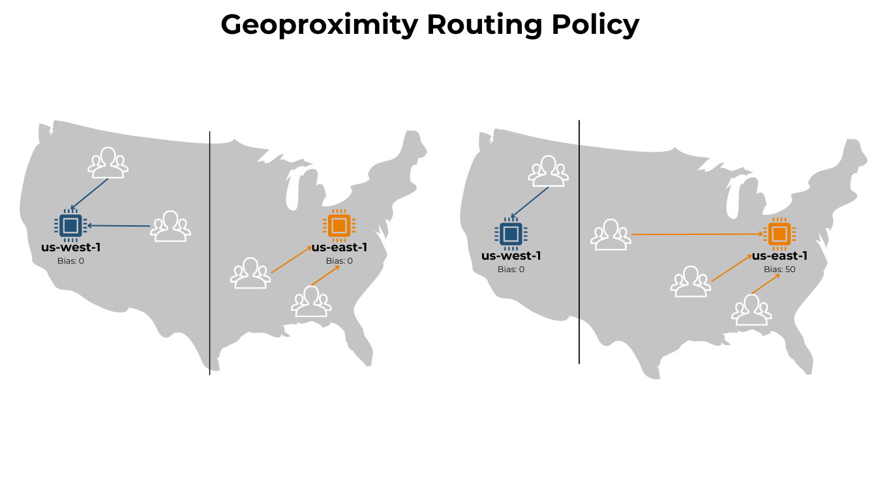

## Route 53
Amazon Route 53 is a highly available, scalable, fully managed and **authoritative(you can update the DNS)** Domain Name System (DNS) web service designed to route end users to Internet applications. Route 53 is designed to connect user requests to infrastructure running in AWS (like EC2 instances, load balancers, or S3 buckets) or external resources. The 53 in Route53 is because it is the traditional DNS port. It offers
- **Domain Registration**: Register domain names directly through Route 53.
- **DNS Service**: Route 53 translates friendly domain names like www.example.com into IP addresses like 192.0.2.1 or AWS resources like EC2.
- **Health Checking**: Monitor the health of your application and route traffic only to healthy endpoints.

**DNS Domain Registrar**: A domain registrar is an organization or commercial entity that manages the reservation of Internet domain names. Examples include GoDaddy, Namecheap, and AWS Route 53.

**DNS Record Types:**
- **A Record**: Maps a domain name to an IPv4 address.
- **AAAA Record**: Maps a domain name to an IPv6 address.
- **CNAME Record**: Maps a domain name to another domain name (canonical name). It cannot be used for the **root domain** (sub domain is allowed). The CNAME can again be a A or AAAA record. You cannot have a CNAME record for the root domain (e.g., example.com) because it would conflict with other records like NS or SOA. You can have a CNAME for subdomains (e.g., www.example.com).
- **Alias Record**: A Route 53-specific extension to DNS that allows you to map a domain or sub domain name only to an AWS resource (like an S3 bucket, CloudFront distribution but you cannot set for **AWS EC2**) without needing to know the IP address. It can only be A/AAAA resources and you can't set the TTL because it is automatically set up Route53. It can be used at the root domain level, unlike CNAME records. Alias records are automatically updated if the underlying resource changes its IP address. It is free of charge and has native health check support.
- **NS Record**: Specifies the name servers for a domain. It indicates which DNS servers are authoritative for the domain and can respond to queries about it.
- **MX Record**: Specifies the mail server responsible for receiving email on behalf of a domain.
- **TXT Record**: Allows you to associate arbitrary text with a domain name. Commonly used for verification purposes (e.g., Google Search Console, SPF records).

**Hosted Zone Types:**
- **Public Hosted Zone**: A container for records that define how you want to route traffic for a domain and its subdomains. It is accessible from the internet.
- **Private Hosted Zone**: A container for records that define how you want to route traffic for a domain and its subdomains within one or more Amazon VPCs. It is not accessible from the internet. Only resources within the specified VPCs can resolve the domain names in the private hosted zone.

**DNS Terminology:**
- **Zone file**: A file that contains all the DNS records for a domain. It is used to configure the DNS settings for a domain and is typically managed by the DNS provider.
- **Name server**: A server that stores DNS records and responds to DNS queries. Name servers are responsible for translating domain names into IP addresses.
- **TTL (Time to Live)**: The amount of time that a DNS record is cached by DNS resolvers. It is specified in seconds and determines how long a record is valid before it needs to be refreshed. Ex: If the TTL is set to 300 seconds, the record will be cached for 5 minutes to all clients. After 5 minutes, the record will be removed from the cache and a new DNS query will be made to resolve the domain name by contacting the authoritative name server. It is mandatory for all records except for Alias records. The default TTL is 300 seconds (5 minutes).
- **DNS Resolver**: A server that translates domain names into IP addresses. It is responsible for querying the DNS hierarchy to find the IP address associated with a domain name.
- **Root Name Server**: The top-level DNS server that contains information about the authoritative name servers for all top-level domains (TLDs). It is the starting point for DNS resolution.
- **TLD (Top Level Domain)**: The last part of a domain name, such as .com, .org, or .net. TLDs are managed by registries and are used to categorize domain names.
- **SLD (Second Level Domain)**: The part of a domain name that comes before the TLD. For example, in the domain name example.com, "example" is the SLD. SLDs are typically registered by individuals or organizations and can be used to create subdomains.
- **Subdomain**: A domain that is part of a larger domain. For example, in the domain name blog.example.com, "blog" is a subdomain of "example.com". Subdomains can be used to organize content or services within a domain.
- **FQDN (Fully Qualified Domain Name)**: A complete domain name that specifies its exact location in the DNS hierarchy. It includes the SLD and TLD, as well as any subdomains. For example, www.example.com is a fully qualified domain name.

**DNS Routing Policies:**
- **Simple Routing**: 
   - Basic routing policy that routes traffic to a single resource.
   - Can specify multiple IP addresses for a single domain name, and Route 53 will return all of them in a random order. Client will choose one of them.
   - When Alias is enabled, only one IP address is returned.
   - Can't be used for health checks.
- **Weighted Routing**: 
   - Distributes traffic across multiple resources based on assigned weights. Useful for A/B testing or gradual migrations.(e.g., 70% to one resource and 30% to another).
   - Can be used for health checks.
   - DNS record must have same name and type.
- **Latency-based Routing**: 
   - Routes traffic to the resource with the lowest latency for the user. 
   - Useful for multi-region applications where you want to direct users to the closest resource with latency as priority.
   - Can be used for health checks.
- **Failover Routing**: Routes traffic to a primary resource unless it becomes unhealthy, in which case it routes to a secondary resource. Useful for disaster recovery scenarios.
- **Geolocation Routing**: Routes traffic based on the geographic location(Continent, Country or US State) of the user(different from latency). Useful for serving different content to users in different regions. Create "Default" record in case no location is matched.   
- **Geoproximity Routing**: Routes traffic based on the geographic location of the user and resources, with optional bias. Useful for directing traffic to resources closer to the user.
   - To change the size of the geographic region, you can use the bias parameter,
      - To expand the region, use a positive bias value(more traffic)
      - To shrink the region, use a negative bias value(less traffic)
   - Helpful to shift traffic towards or away from specific resources based on user location.
   
- **IP based Routing**: Routes traffic based on the IP address of the user. Useful for directing traffic to specific resources based on user location.
   - You provide a list of IP address/CIDR blocks and Route 53 will route traffic to the resource associated with the IP address that matches the user's IP address.
- **Multivalue Routing**: 
   - Similar to simple routing but allows you to return multiple IP addresses for a single domain name(use when route traffic to multiple resources)
   - Can be used for health checks.
   - Route 53 will return up to 8 healthy IP addresses in a random order for each multivalue query.
   - Cannot be used as a substitute for a load balancer. It is not a load balancer.

**Health Checks:**
- It is available for all routing policies except Simple Routing.
- It has automated DNS failover capabilities.
- There are 3 types of health checks:
   - **Monitor at Endpoint**: Monitors the health of a specific endpoint (e.g., an EC2 instance or load balancer) by sending HTTP/HTTPS requests and checking the response.
      - There are about 15 health checkers available in Route 53.
         - By default, Route 53 uses 3 health checkers to check the health of a resource. 
         - We can set the health check interval to 30 seconds, 60 seconds, or 120 seconds. The default is 30 seconds.(lower the interval, higher the cost).
         - If health check says it has > 18% of health, it will be considered healthy. If it has < 18% of health, it will be considered unhealthy.
      - The health check passes only if the response code is 2xx or 3xx. Health check can also be setup based on the response text in the first 5120 bytes of the response body.
      - **You should always allow your router firewall to allow Route 53(port 53) Health Checkers.**
   - **Calculated Health Check**: Combines the results of multiple health checks to determine the overall health of a resource. It can be used to create complex health check scenarios.
      - You can combine multiple health checks into a single calculated health check using **OR / AND** operators.
      - Can monitor upto 256 Child Health Checks and specify parameter to pass in that.
   - **CloudWatch Health Check or Private Hosted Zone Health Check**: Monitors the health of resources within a private hosted zone or VPC using CloudWatch metrics. 
      - Create CloudWatch metrics and associate a alarm with it. Then create a health check that checks the alarm. 

### Interview Questions:
1. **Difference between A and CNAME records?**
   - A record maps a domain name to an IP address, while a CNAME record maps a domain name to another domain name. CNAME cannot be used for the root domain.

2. **What is Alias record?**
   - An Alias record is a Route 53-specific extension to DNS that allows you to map a domain name to an AWS resource (like an S3 bucket or CloudFront distribution) without needing to know the IP address. It can be used at the root domain level, unlike CNAME records.
   - Alias records are automatically updated if the underlying resource changes its IP address.

3. **What is Hosted Zone?**
   - A hosted zone is a container for records that define how you want to route traffic for a domain and its subdomains. It can be public (accessible from the internet) or private (accessible only within an Amazon VPC).
    - Each hosted zone contains a set of DNS records that define how to route traffic for the domain and its subdomains.

4. **Difference between Geolocation and Geoproximity routing?**
   - Geolocation routing routes traffic based on the geographic location of the user, while Geoproximity routing routes traffic based on the geographic location of the user and resources, with optional bias. 
   - Geoproximity routing allows you to control how much traffic is routed to each resource based on its proximity to the user.
   - Geolocation routing is based solely on the user's location, while Geoproximity routing can be adjusted to favor certain resources over others.

5. **How Route 53 integrates with CloudFront?**
   - Route 53 can be used to create a custom domain name for a CloudFront distribution. You can create an Alias record in Route 53 that points to the CloudFront distribution's domain name.
   - This allows you to use your own domain name (e.g., www.example.com) instead of the default CloudFront domain name (e.g., d1234567890.cloudfront.net).
   - Route 53 also provides DNS failover capabilities, allowing you to route traffic to a backup CloudFront distribution if the primary one becomes unavailable.
