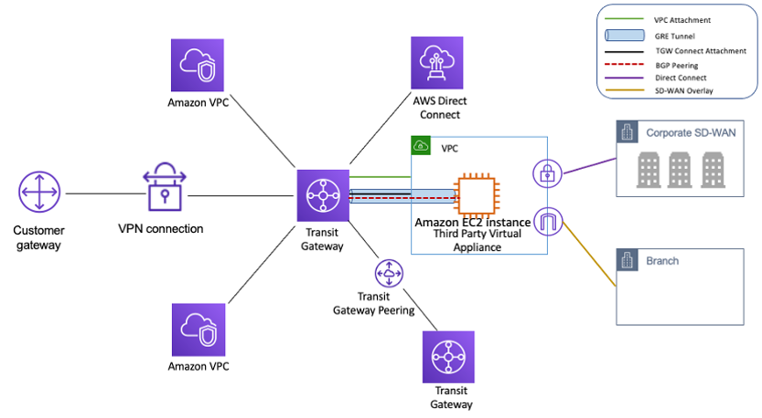

## AWS Transit Gateway (TGW)

**AWS Transit Gateway** is a regional network hub that connects VPCs, on-premises networks (via VPN or Direct Connect), and other AWS services through a **single central gateway** — instead of building a mesh of individual VPC peering connections.

- Acts as a **cloud router** — any network attached to the TGW can route traffic to any other attached network.
- **Transitive routing** — unlike VPC Peering, traffic can flow through the TGW (A → TGW → B → TGW → C).
- Regional service — attachments in the same region. Use **inter-region peering** for cross-region.
- Supports thousands of VPCs and on-premises connections.

---

## Why Transit Gateway Over VPC Peering

With VPC Peering, every pair of VPCs needs its own connection — this becomes unmanageable at scale:

```
VPC Peering (5 VPCs = 10 peering connections):

VPC-A ──── VPC-B
  │  \   /  │
  │   VPC-C │
  │  /   \  │
VPC-D ──── VPC-E
```

With Transit Gateway (5 VPCs = 5 attachments):

```
        VPC-A
          │
VPC-E ── TGW ── VPC-B
          │
        VPC-C
          │
        VPC-D
```

Any VPC can reach any other VPC through the TGW — one attachment per network.

---

## Attachments

A **TGW Attachment** is how you connect a network to the Transit Gateway:

| Attachment Type | Connects |
|---|---|
| **VPC Attachment** | A VPC (pick which subnets per AZ) |
| **VPN Attachment** | Site-to-Site VPN (on-premises via IPsec) |
| **Direct Connect Gateway Attachment** | On-premises via Direct Connect |
| **Transit Gateway Peering** | Another Transit Gateway (same or different region) |

---

## Route Tables

Transit Gateway has its own **TGW Route Tables** — separate from VPC route tables. They control which attachments can send traffic to which other attachments.

```
TGW Route Table (default):
Destination      Target
10.0.0.0/16   →  VPC-A attachment
172.16.0.0/16 →  VPC-B attachment
192.168.0.0/16 → VPN attachment (on-premises)
```

**Route propagation** — VPN and Direct Connect attachments can automatically propagate their routes into the TGW route table via BGP.

### Isolated vs Shared Routing

You can create **multiple TGW route tables** to control which VPCs can talk to each other:

```
Production Route Table:
  → VPC-Prod-A, VPC-Prod-B, VPN (on-premises)

Dev Route Table:
  → VPC-Dev-A, VPC-Dev-B
  (no route to production VPCs — dev cannot reach prod)
```

This is how you enforce **network segmentation** without separate VPCs or accounts.

---

## Multicast Support

Transit Gateway supports **IP multicast** — send a single packet to multiple destinations simultaneously.

- Used for media streaming, financial market data feeds, live video distribution.
- Must be enabled at TGW creation (cannot enable later).
- Create a **multicast domain** and add VPC subnets as members.

---

## Cross-Region Peering

TGW is regional — to connect networks across regions, use **TGW Peering**:

```
Region: us-east-1          Region: eu-west-1
  TGW-A ◄──── peering ────► TGW-B
    │                           │
  VPC-A1                      VPC-B1
  VPC-A2                      VPC-B2
  On-premises (VPN)
```

- Traffic between peered TGWs uses AWS's private backbone — not the internet.
- Routing between regions is **static** — no BGP between TGWs.

---

## Transit Gateway vs VPC Peering

| | Transit Gateway | VPC Peering |
|---|---|---|
| **Routing** | Transitive (A → TGW → B → TGW → C) | Non-transitive (A → B only) |
| **Scale** | Thousands of VPCs via single hub | N×(N-1)/2 connections for N VPCs |
| **Cross-region** | Yes — TGW peering | Yes — inter-region peering |
| **Cross-account** | Yes — AWS Resource Access Manager (RAM) | Yes |
| **Route control** | Centralized TGW route tables | Per-VPC route tables |
| **Bandwidth** | Up to 50 Gbps per attachment | No limit (uses AWS backbone) |
| **Cost** | Per attachment-hour + per GB | Free (only data transfer cost) |
| **Best for** | Large, complex multi-VPC networks | Simple 1-to-1 VPC connections |


