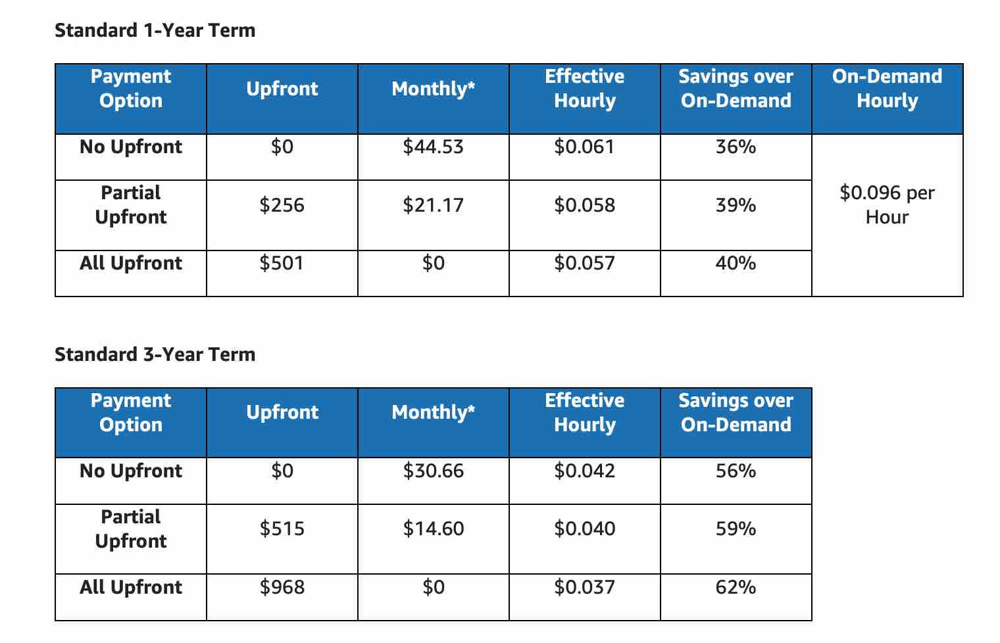
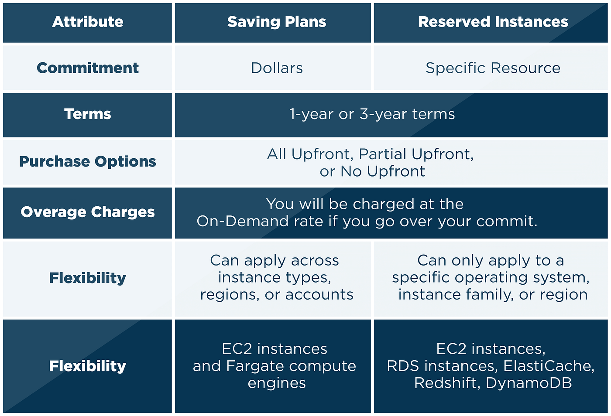
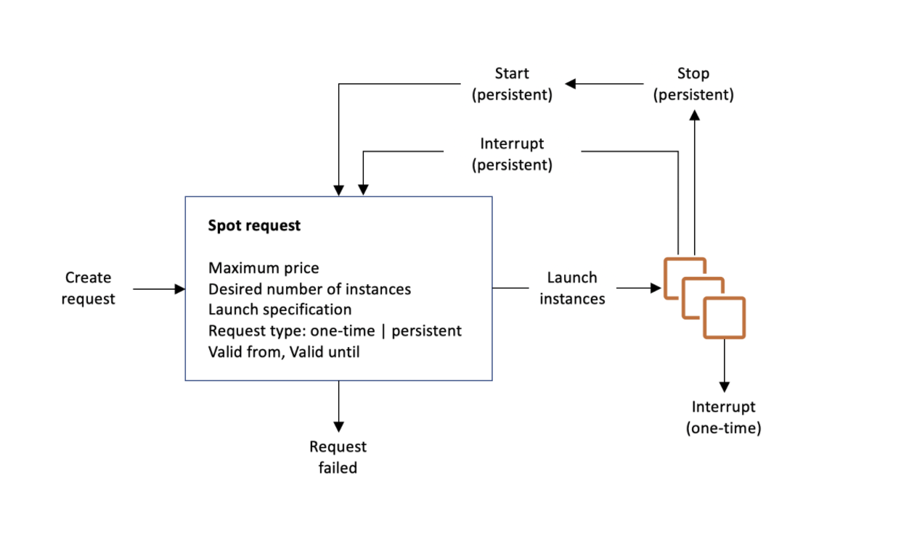
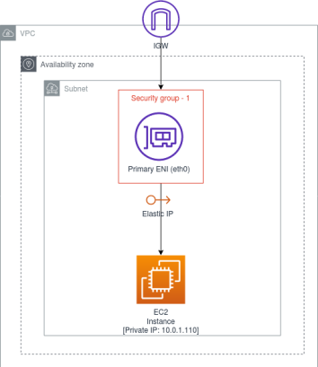

## Amazon EC2 (Elastic Compute Cloud)

Amazon Elastic Compute Cloud (EC2) is a web service that provides resizable compute capacity in the cloud. It allows users to launch and manage virtual machines/servers (referred to as EC2 instances) in a scalable and cost-effective manner. EC2 eliminates the need for physical hardware, offering on-demand compute resources that scale based on your application needs.

### Features of Amazon EC2
- **Scalability**: Fast & easily scale up or down based on demand (using Auto Scaling and Elastic Load Balancer).
- **Flexibility & Customizable**: Choose from a variety of instance types, operating systems, memory, storage, or GPU-intensive workloads, and software packages to meet your specific needs.
- **Cost-Effective**: Pay-as-you-go pricing.
- **Security**: Provides a secure environment with features like Virtual Private Cloud (VPC), security groups, and IAM roles to control access to resources. Also provides Key Pairs for SSH access to instances.
- **Integration**: Seamlessly integrates with other AWS services like Amazon S3, RDS, Lambda, ECS, EKS, and more.
- **Static IP Addresses** (Elastic IPs): This feature is not free.
- **EBS Volumes**: Persistent block storage for EC2 instances.

- **Scale out(Horizontal scaling):** A scale out operation implies you scale by adding more instances to your existing pool of resources. This is Fault Tolerant and High Availability.
- **Scale up(Vertical scaling):** A scale up operation implies you scale by adding more power (CPU, RAM, memory) to an existing instance. This is not Fault Tolerant and High Availability.

### EC2 Instance Types
EC2 instances are categorized into different families based on their use cases. 
- **General Purpose**: Balanced compute, memory, and networking resources. Examples: T3, M5, M6g.(Application: web servers, code repositories, etc.)
- **Compute Optimized**: High-performance processors for compute-intensive tasks. Examples: C5, C6g.(Application: Game servers, etc.)
- **Memory Optimized**: Designed for memory-intensive applications. Examples: R5, R6g.(Application: high-performance databases, in-memory analytics etc.)
- **Storage Optimized**: High disk throughput and IOPS for data-intensive applications. Examples: I3, D2.(Application: NoSQL databases, data warehousing, etc.)
- **Accelerated/GPU Intensive Computing**: GPU-based instances for machine learning and graphics-intensive applications. Examples: P3, G4.(Application: Machine learning, 3D rendering, etc.)

### EC2 Pricing Models
- **On-Demand Instances**: Pay-per-use pricing for instances that are launched and terminated as needed. Based on the number of seconds/hours the instance is running.
- **Reserved Instances**: Commit to a one or three-year term for discounted pricing. It is kind of booking an instance for a specific period.(Applies discount upto 70%)
- **Spot Instances**: Purchase unused EC2 capacity at reduced rates. Ideal for short-term, flexible workloads. Spot instances can be interrupted by AWS with two-minute warning if the capacity is needed elsewhere.(Applies discount upto 90%)
- **Dedicated Hosts**: Physical servers dedicated to your use, providing control over how instances are placed on the server. Allows you to use software licenses. (Applies discount upto 70%)
- No pricing for Data Transfer In bound & between other services within same region, but Data Transfer Out is charged based on the amount of data transferred out of AWS.

## EC2 Reserved Instances
- **Standard Reserved Instances**: Provide a significant discount (up to 75%) compared to On-Demand pricing. They are best for steady-state workloads and can be modified to change the Availability Zone, instance type, or network platform.
- **Convertible Reserved Instances**: Allow you to change the instance type, operating system, and tenancy over the term of the reservation, providing flexibility to adapt to changing needs. Provides a discount of up to 55% compared to On-Demand pricing.
- **Scheduled Reserved Instances**: Allow you to reserve capacity for specific time periods, such as daily or weekly, providing flexibility for workloads that require predictable capacity at specific times.

## EC2 Saving Plans
Saving Plans are flexible pricing models that provide significant savings on your AWS compute usage. They offer a flexible pricing model that allows you to save up to 72% on your AWS compute costs compared to On-Demand pricing. There are two types of Saving Plans:
- **Compute Savings Plans**: Provide the most flexibility and apply to any EC2 instance regardless of region, instance family, operating system, or tenancy. They offer savings of up to 66% compared to On-Demand pricing.
- **EC2 Instance Savings Plans**: Provide the most savings when you commit to a specific instance family within a region, offering savings of up to 72% compared to On-Demand pricing.

## EC2 Spot Instances
Spot Instances are a cost-effective way to run applications on AWS by taking advantage of unused EC2 capacity. They allow you to bid on spare EC2 capacity at significantly lower prices than On-Demand instances. Spot Instances can be interrupted by AWS with two-minute warning if the capacity is needed elsewhere.
- **Spot Fleet**: A collection of Spot Instances that are launched and managed as a single unit. Spot Fleet allows you to specify the target capacity, instance types, and pricing strategy for your Spot Instances.

## EC2 Dedicated Hosts
Dedicated Hosts are physical servers dedicated to your use, providing control over how instances are placed on the server. They allow you to use your existing server-bound software licenses and provide visibility into the number of sockets, cores, and host ID.**We can use Dedicated Hosts to meet compliance requirements for certain workloads. Also we can create multiple instances as needed.**

## EC2 Dedicated Instances
Dedicated Instances are EC2 instances that run on hardware dedicated to a single customer. They provide the same level of isolation as Dedicated Hosts but do not provide visibility into the underlying hardware. **Dedicated Instances are charged at a higher rate than standard EC2 instances.**

## EC2 Capacity Reservations
Capacity Reservations allow you to reserve capacity for your EC2 instances in a specific Availability Zone. This ensures that you have the capacity you need when you need it, even during peak demand periods. Capacity Reservations are charged at the same rate as On-Demand instances even it is not used and can be used in conjunction with other pricing models, such as Reserved Instances and Spot Instances. It does not provide any discount on the pricing.

## EC2 Placement Groups
Placement Groups are a way to influence the placement of EC2 instances to meet workload requirement. There are three types of placement groups:
- **Cluster Placement Groups**: Group instances within a single Availability Zone to provide low latency and high throughput. Ideal for applications that require high performance and low latency, such as high-performance computing (HPC) applications.
- **Spread Placement Groups**: Ensure that each instance is placed on distinct hardware to reduce the risk of simultaneous failures. They are placed in different racks and power sources, also in different Availability Zones. Ideal for applications that require high availability and fault tolerance, such as critical applications or databases. Can only create a maximum of 7 instances per placement group.
- **Partition Placement Groups**: Similar to Spread Placement Groups but allow you to define partitions within a single Availability Zone. It is limited to single AZ. Each partition can contain multiple instances, and instances in different partitions do not share the same hardware. Ideal for applications that require high throughput and low latency, such as big data applications or distributed databases. Can create a maximum of 200 instances per placement group. Upto 7 partitions (Server rack) can be created in a placement group (per AZ).

## ENI (Elastic Network Interface)
- An ENI is a virtual network interface that can be attached to an EC2 instance. It provides a way to manage network connectivity and security for your instances.
- Same as a physical network interface card (NIC) in a physical server or VEth in Docker.
- An ENI can have 1 primary private IP address and multiple secondary private IP addresses, 1 Elastic private IP address, 1 public IP address, MAC address, and multiple security groups.
- ENIs can be created and attached to instances in a VPC, allowing you to manage network connectivity and security for your instances.
- ENIs can be detached from one instance and attached to another instance, allowing you to move network interfaces between instances without changing the IP address.
- ENI is specific to a single AZ, but can be moved between instances in the same AZ.

## EC2 Hibernate
- When you shut down your EC2 instance, the contents of the instance's memory (RAM) are lost, and the instance is stopped. You can start the instance again, but it will not retain any data in memory. When you create or start an instance, the boot volume is created from the AMI, and the instance starts with a clean state.
- When you stop your EC2 instance, the contents of the instance's memory (RAM) are saved to the EBS root volume, allowing you to resume your work later without losing any data.
- Hibernate is similar to stopping an instance, but it saves the contents of the instance's memory (RAM) to the EBS root volume instead of shutting down the instance completely.
- When you hibernate an instance, the instance's state is saved to the EBS root volume, and the instance is stopped. When you start the instance again, it resumes from the saved state from the EBS root volume, allowing you to continue working without losing any data.
- Hibernate is useful for workloads that require a quick startup time and want to retain the instance's state without losing any data.
- Condition for Hibernate:
  - The instance must be an EBS-backed instance.
  - The instance must have an EBS root volume that is configured for hibernation & must encrypted.
  - The instance must have sufficient EBS storage to save the contents of the instance's memory (RAM).
  - The instance must be stopped before it can be hibernated.
  - The RAM size must be less than 150 GB.
  - The instance must be in a supported instance type (e.g., T3, M5, C5, R5, etc.).
  - Available for On-demand, spot and reserved instances.
  - You cannot hibernate a system for more than 60 days.
   - **Hibernate is not available for all instance types and regions.**

## EC2 AMI (Amazon Machine Image):
- An AMI is a pre-configured template that contains the operating system, application server, and software applications required to launch an EC2 instance. It serves as a blueprint for creating new instances and can be customized to meet specific requirements.
- AMIs can be created from existing EC2 instances or can be obtained from the AWS Marketplace. They can be shared with other AWS accounts or made public for others to use.
- AMIs are region-specific, meaning they can only be used in the region where they were created. However, you can copy AMIs to other regions if needed.
- AMIs can be categorized into three types:
   - **Public AMIs**: Available to all AWS users and can be used to launch instances without any restrictions. These AMIs are created by AWS.
   - **Private AMIs**: Created by users and are only accessible to the AWS account that created them. Private AMIs can be shared with specific AWS accounts or made public if desired.
   - **Marketplace AMIs**: Available for purchase from the AWS Marketplace. These AMIs are created by third-party vendors and sold in AWS Marketplace and can include pre-installed software and applications.

## Instance Store:
- Instance Store is temporary storage that is physically attached to the host (EC2) server. Data is lost when the instance is stopped or terminated.
- It is suitable for temporary data or caching, and EBS volumes can be backed up using snapshots, while Instance Store data cannot be recovered after instance termination.
- Instance Store volumes are ephemeral and are not persistent across instance stops or terminations. 
- The Instance store storage offers very high IOPS. They are ideal for applications that require high IOPS and low latency.
- Instance Store volumes are physically attached to the host server and are not network-attached like EBS volumes. This means that Instance Store volumes can provide higher performance for certain workloads, such as high-performance computing (HPC) or data-intensive applications.

## Interview Questions
1. **Difference between EC2 and Lambda?**
   - EC2 is a virtual server that you manage, while Lambda is a serverless compute service that runs code in response to events without provisioning or managing servers.
   - EC2 is suitable for long-running applications, while Lambda is ideal for short-lived tasks or event-driven applications.

2. **What is AMI? Can you create your own AMI?**
   - AMI (Amazon Machine Image) is a pre-configured template that contains the operating system, application server, and applications required to launch an EC2 instance.
   - Yes, you can create your own AMI from an existing EC2 instance by creating a **snapshot** or use AWS Marketplace to find pre-built AMIs.

3. **What is the difference between EBS and Instance Store?**
   - EBS (Elastic Block Store) is a persistent block storage service that can be attached to EC2 instances, while Instance Store is temporary storage that is physically attached to the host (EC2) server and data is lost when the instance is stopped or terminated.
   - EBS volumes can be backed up using snapshots, while Instance Store data cannot be recovered after instance termination(Shutdown).
   - EBS is suitable for data that needs to persist beyond the life of the instance, while Instance Store is suitable for temporary data or caching.

4. **EC2 User Data Scripts VS EC2 Metadata?**
   - **User Data Scripts**: Scripts that run when an instance is launched. They are used to perform common automated configuration tasks and run only once at launch time.(e.g., installing software, configuring settings)
   - **EC2 Metadata**: Provides information about the instance itself, such as instance ID, public IP address, and security groups. It can be accessed from within the instance using a special URL (http://169.254.169.254/latest/meta-data/).

5. **EC2 Security Groups vs NACLs?**
   - **Security Groups**: Act as a virtual firewall for your EC2 instances to control inbound and outbound traffic. They are stateful, meaning if you allow an incoming request, the response is automatically allowed.
   - **NACLs (Network Access Control Lists)**: Act as a firewall for controlling traffic in and out of one or more subnets. They are stateless, meaning you must explicitly allow both inbound and outbound traffic.

   - **Security Groups are associated with EC2 instances, while NACLs are associated with subnets in a VPC.**

6. **EC2 Auto Scaling VS Load Balancing?**
   - **Auto Scaling**: Automatically adjusts the number of EC2 instances in a group based on demand. It ensures that you have the right number of instances running to handle the load.
   - **Load Balancing**: Distributes incoming traffic across multiple EC2 instances to ensure no single instance is overwhelmed. It improves availability and fault tolerance.
   - **Auto Scaling is about scaling the number of instances, while Load Balancing is about distributing traffic among those instances.**
   - **Auto Scaling can work with Load Balancers to ensure that new instances are automatically registered with the load balancer.**

7. **Types of Load Balancers**
   - **Application Load Balancer (ALB)**: Operates at the application layer (Layer 7) and is ideal for HTTP/HTTPS traffic. It can route requests based on content and supports WebSocket and HTTP/2.(Application: microservices, containerized applications, etc.)
   - **Network Load Balancer (NLB)**: Operates at the transport layer (Layer 4) and is designed for high-performance TCP/UDP traffic. It can handle millions of requests per second with low latency.(Application: real-time applications, gaming, etc.)
   - **Classic Load Balancer**: Operates at both Layer 4 and Layer 7, but is considered legacy. Provides basic load balancing across multiple Amazon EC2 instances and operates at both the request level and connection level.(Application: legacy applications, simple load balancing needs, etc.)
   - **Gateway Load Balancer**: Combines a transparent network gateway and a load balancer to deploy, scale, and manage third-party virtual appliances(to distribute connections across third-party virtual appliances)

8. **What is an Elastic IP?**
   - An Elastic IP address is a static IPv4 address designed for dynamic cloud computing. It allows you to associate a public IP address with your EC2 instance, which can be remapped to another instance in case of failure or maintenance.
   - Elastic IPs are not free, you are changed even if the Elastic IP is not associated with any instance.