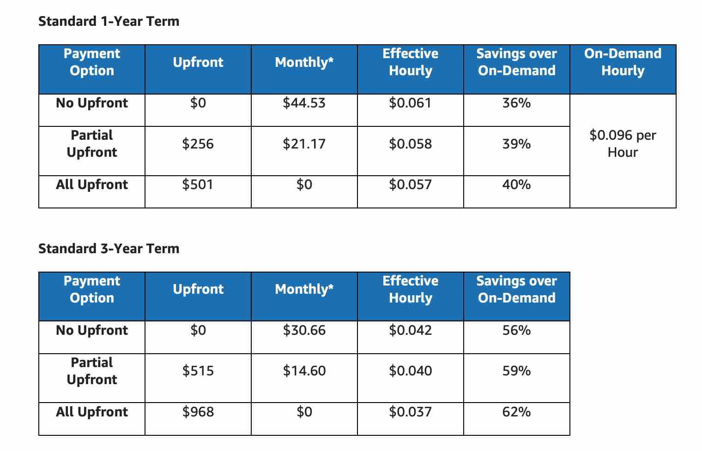
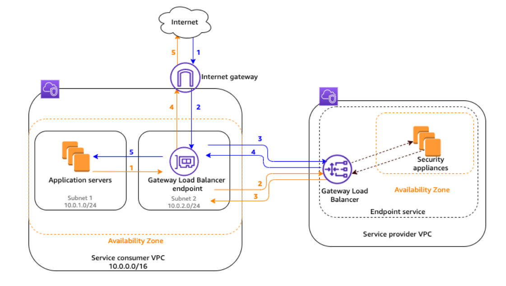
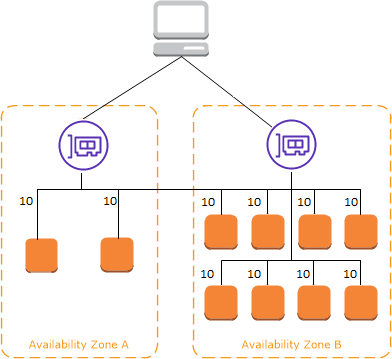
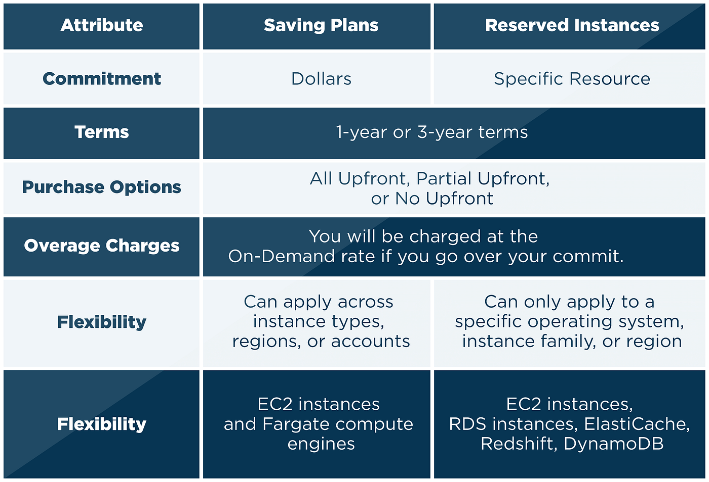
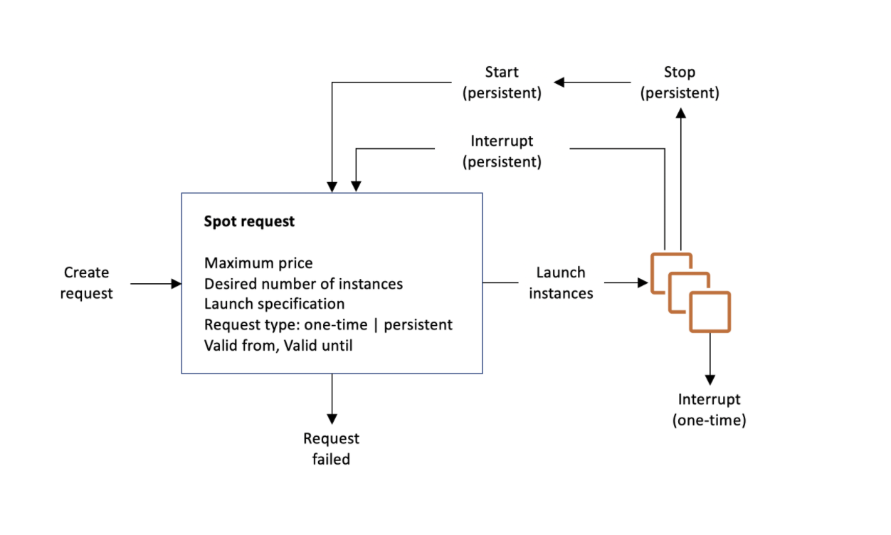
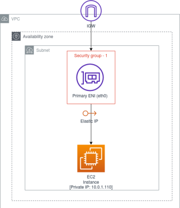

## Amazon EC2 (Elastic Compute Cloud)

Amazon Elastic Compute Cloud (EC2) is a web service that provides resizable compute capacity in the cloud. It allows users to launch and manage virtual machines/servers (referred to as EC2 instances) in a scalable and cost-effective manner. EC2 eliminates the need for physical hardware, offering on-demand compute resources that scale based on your application needs.

### Features of Amazon EC2
- **Scalability**: Fast & easily scale up or down based on demand (using Auto Scaling and Elastic Load Balancer).
- **Flexibility & Customizable**: Choose from a variety of instance types, operating systems, memory, storage, or GPU-intensive workloads, and software packages to meet your specific needs.
- **Cost-Effective**: Pay-as-you-go pricing.
- **Security**: Provides a secure environment with features like Virtual Private Cloud (VPC), security groups, and IAM roles to control access to resources. Also provides Key Pairs for SSH access to instances.
- **Integration**: Seamlessly integrates with other AWS services like Amazon S3, RDS, Lambda, ECS, EKS, and more.
- **Static IP Addresses** (Elastic IPs): These are the fixed IP addresses that can be associated with your instances. By default, 5 elastic IP is allowed per account(request to AWS for more) This feature is not free.
- **EBS Volumes**: Persistent block storage for EC2 instances.


## EC2 Load Balancing
- **Elastic Load Balancing (ELB)**: Automatically distributes incoming application traffic across multiple targets, such as EC2 instances, ECS containers, Lambda and IP addresses(private). It helps ensure high availability and fault tolerance for your applications.
- **Benefits of Load Balancing**:
  - Distribute Traffic
  - Improve Fault Tolerance
  - Increase Availability
  - Health Checks(Protocols: HTTP, Port: 4567, Endpoint: /health)
  - SSL Termination
  - Single point of access for clients
  - Can traffic to multiple target groups (e.g., multiple applications) using a single load balancer.
- **Types of Load Balancers**:
  - **Application Load Balancer (ALB)**: Operates at the application layer (Layer 7) and is ideal for HTTP/HTTPS traffic. It can route requests based on content and supports WebSocket and HTTP/2. Supports Path-based routing, host-based routing, and query string parameter routing. It is suitable for microservices and containerized applications.
  - Instance can get the IP of the Client using the X-Forwarded-For header, Port: X-Forwarded-Port header, Protocol: X-Forwarded-Proto header.
  - **Network Load Balancer (NLB)**: Operates at the transport layer (Layer 4) and is designed for high-performance TCP/UDP & TLS traffic. **It is suitable for applications with millions of requests per second with low latency, such as real-time applications, gaming, and IoT.** It provides static IP addresses(1 per AZ) and supports Elastic IP(per AZ). Target groups can be IP addresses(private only), EC2 and ALB. It supports **HTTPS, HTTP & TCP** health checks.
  - **Classic Load Balancer**: Operates at both Layer 4 and Layer 7, but is considered legacy. Provides basic load balancing across multiple Amazon EC2 instances and operates at both the request level and connection level.(forbidden to use)
  - **Gateway Load Balancer**: Operates at Layer 3(Network Layer, IP protocol: GENEVE, port: 6081) and is designed to deploy, scale, and manage third-party network virtual appliances. It combines a transparent network gateway and a load balancer to distribute connections across third-party virtual appliances. It is suitable for firewalls, intrusion detection systems, and deep packet inspection systems.
  

  **Session Stickiness in Target Group**: Session stickiness (also known as session affinity) is a feature that allows the load balancer to route requests from a specific client to the same target instance for the duration of the session(expiry) using cookies. This is useful for applications that require session persistence, such as shopping carts or user sessions. Session stickiness can be configured using cookies or IP addresses.
  - Types of cookies:
    - **Application based cookies**: Cookies generated by the application itself. The load balancer uses these cookies to route requests to the same target instance.
         - **Custom Cookies**: Cookies that are generated by the application and can be configured to include specific attributes, such as expiration time and path. Can use custom cookie names. Reserved cookie names: AWSALB, AWSALBAPP, AWSALBTG.
         - **Application Cookies**: Cookies that are generated by the load Balancer and are used to maintain session state. The load balancer uses these cookies to route requests to the same target instance. Cookie name: AWSALBAPP.
    - **Duration based cookies**: Cookies that are generated by the load balancer and have a specific expiration time. The load balancer uses these cookies to route requests to the same target instance for the duration of the cookie's lifetime.Cookie name: AWSALB.


- **Cross-Zone Load Balancing**: Distributes incoming traffic across all registered targets in all enabled Availability Zones. This helps ensure that traffic is evenly distributed across all targets, regardless of their Availability Zone. Cross-Zone Load Balancing is enabled by default for Application Load Balancers(No extra charges). It is not enabled by default for NLB and Gateway Load Balancers(if enabled: extra charge applies, Classic LB is exemption).

### SSL/TLS Certificates
 - In AWS, SSL/TLS certificates are used to secure communication between clients and servers. They are used to encrypt data in transit and ensure the authenticity of the server.
 - AWS Certificate Manager (ACM) is a service that provides SSL/TLS certificates for use with AWS services. ACM allows you to easily provision, manage, and deploy SSL/TLS certificates for your applications.
 - SNI(Server Name Indication) is an extension of the TLS protocol that allows multiple SSL/TLS certificates to be associated with a single IP address. This allows you to host multiple secure websites on a single server without requiring a separate IP address for each website. Works with ALB and NLB and Cloudfront

### Connection draining/Deregistration delay
- Connection draining(for CLB) & Deregistration delay(for ALB & NLB) is a feature that allows existing connections to complete while preventing new connections from being established to instances that are being deregistered or unhealthy. The default timeout for connection draining/deregistration delay is 300 seconds (5 minutes), but it can be configured to a value between 1 and 3600 seconds (1 hour) & also can be set to 0(disabled).

## EC2 Auto Scaling
- **Auto Scaling**: Automatically adjusts the number of EC2 instances in a group based on demand. It ensures that you have the right number of instances running to handle the load. Auto Scaling can be configured to scale in (remove instances) or scale out (add instances) based on predefined policies, schedules, or health checks. It is free service, only pay for resources created by Auto Scaling.
- There are 3 types of scaling:
  - **Dynamic Scaling**: Automatically adjusts the number of instances in response to changing demand. It can scale in or out based on CloudWatch metrics, such as CPU utilization or network traffic.
      - **Target Tracking Scaling**: Automatically adjusts the number of instances to maintain a specified target value for a specific metric, such as CPU utilization or request count.
      - **Simple/Step Scaling**: Allows you to define scaling policies based on CloudWatch alarms. You can specify the number of instances to add or remove based on the alarm state (e.g., CPU utilization above a certain threshold). **Step scaling** allows you to define multiple steps for scaling actions based on different alarm states. **Simple scaling** allows you to define a single scaling action for each alarm state.
  - **Scheduled Scaling**: Allows you to set a schedule for scaling actions based on predictable changes in demand. For example, you can schedule scaling actions to occur at specific times of the day or week.
  - **Predictive Scaling**: Uses machine learning to predict future demand and automatically adjusts the number of instances in advance. It can help ensure that you have the right number of instances running to handle expected traffic spikes or drops.

- **Scaling Cooldown**: After a scaling activity is triggered, there is a cooldown period during which no further scaling activities will be initiated. This helps prevent rapid fluctuations in the number of instances and allows the system to stabilize after a scaling action. The default cooldown period is 300 seconds (5 minutes), but it can be configured.

### Rebalancing

ASG always tries to keep instances **evenly spread across AZs**. Rebalancing is triggered when the balance breaks:

| Trigger | Why it Breaks Balance |
|---|---|
| AZ recovered after outage | ASG had concentrated instances in remaining AZs |
| Instances manually terminated | One AZ now has fewer instances |
| New AZ added to ASG | Existing instances are all in old AZs |
| Spot Capacity Rebalancing | Spot instance at high interruption risk — proactive replacement |

**How rebalancing works — Launch first, terminate second:**
```
Before:  AZ-A [3]   AZ-B [1]   ← imbalanced

Step 1:  AZ-A [3]   AZ-B [2]   ← launch in underrepresented AZ first
Step 2:  AZ-A [2]   AZ-B [2]   ← then terminate from overrepresented AZ

Result:  balanced, capacity never drops below desired
```
> ASG launches the replacement **before** terminating the old instance — so you temporarily exceed the max capacity by 10% during rebalancing. This is intentional.

---

### Scaling Activity — Termination Policy (Scale In)

When ASG scales **in** (removes instances), it follows a default sequence to decide which instance to terminate:

```
Step 1 → Pick the AZ with the MOST instances
            │
Step 2 → From that AZ, find instances using the OLDEST launch template / config
            │
Step 3 → Tie-break: terminate the instance CLOSEST to the next billing hour
            │
           TERMINATE
```

**Built-in termination policies** (choose one or chain them):

| Policy | Behaviour |
|---|---|
| `Default` | Steps 1→2→3 above |
| `OldestInstance` | Always removes the oldest instance regardless of AZ |
| `NewestInstance` | Removes the newest — useful to roll back a bad deployment |
| `OldestLaunchTemplate` | Removes instances using the oldest template version |
| `ClosestToNextInstanceHour` | Maximise cost savings by removing instances about to be billed |
| `AllocationStrategy` | Optimise mix of On-Demand + Spot (used with mixed instance groups) |

---

### Instance Refresh

When you update a **Launch Template** (new AMI, new user data, etc.) and want existing running instances to pick up the change — use **Instance Refresh** instead of manually terminating them.

```
Updated Launch Template v2
         │
         ▼
Instance Refresh starts
         │
  ┌──────▼──────────────────────────────┐
  │  Batch 1: terminate old → launch new │  ← waits for new instance to pass health check
  │  Batch 2: terminate old → launch new │
  │  Batch N: ...                        │
  └──────────────────────────────────────┘
         │
         ▼
All instances now running on Launch Template v2
```

**Key settings:**
- **Min Healthy %** — percentage of fleet that must stay healthy during the refresh (e.g., 90% = replace only 10% at a time).
- **Instance Warmup** — seconds to wait after launch before counting the new instance as healthy and moving to the next batch.
- If a new instance fails health checks → refresh pauses automatically.

---

- There are 2 main types of scaling the instances:
  - **Vertical Scaling(Scale Up/Down)**: Increasing or decreasing the size of an instance (e.g., RAM, CPU, etc,.) to meet demand. This is not fault-tolerant and does not provide high availability.(Scale up: Increasing the size of an instance, Scale down: Decreasing the size of an instance)
  - **Horizontal Scaling(Scale Out/In)**: Adding or removing instances to meet demand. This is fault-tolerant and provides high availability.(Scale out: Adding more instances, Scale in: Removing instances)

### EC2 Instance Types
EC2 instances are categorized into different families based on their use cases. 
- **General Purpose**: Balanced compute, memory, and networking resources. Examples: T3, M5, M6g.(Application: web servers, code repositories, etc.)
- **Compute Optimized**: High-performance processors for compute-intensive tasks. Examples: C5, C6g.(Application: Game servers, etc.)
- **Memory Optimized**: Designed for memory-intensive applications. Examples: R5, R6g.(Application: high-performance databases, in-memory analytics etc.)
- **Storage Optimized**: High disk throughput and IOPS for data-intensive applications. Examples: I3, D2.(Application: NoSQL databases, data warehousing, etc.)
- **Accelerated/GPU Intensive Computing**: GPU-based instances for machine learning and graphics-intensive applications. Examples: P3, G4.(Application: Machine learning, 3D rendering, etc.)

### EC2 Pricing Models
- **On-Demand Instances**: Pay-per-use pricing for instances that are launched and terminated as needed. Based on the number of seconds/hours the instance is running.
- **Reserved Instances**: Commit to a one or three-year term for discounted pricing. It is kind of booking an instance for a specific period.(Applies discount upto 70%)
- **Spot Instances**: Purchase unused EC2 capacity at reduced rates. Ideal for short-term, flexible workloads. Spot instances can be interrupted by AWS with two-minute warning if the capacity is needed elsewhere.(Applies discount upto 90%)
- No pricing for Data Transfer In bound & between other services within same region, but Data Transfer Out is charged based on the amount of data transferred out of AWS.

## Launch Template vs Launch Configuration

Both define the **instance configuration blueprint** used by Auto Scaling Groups (and direct instance launches) — AMI, instance type, key pair, security groups, user data, and storage settings.

### Launch Configuration *(legacy)*
- Older, simpler version — **it is not possible to modify a Launch Configuration once it is created**. To change anything (AMI, instance type, SG, user data), you must create a brand new Launch Configuration and update the ASG to point to it.
- Does **not** support multiple instance types, Spot + On-Demand mix, or placement groups.
- AWS has stopped adding new features to Launch Configurations — new workloads should use Launch Templates.

### Launch Template *(recommended)*
- **Versioned** — create multiple versions of the same template; specify which version the ASG uses (latest, default, or a pinned number).
- Supports **mixed instance types** (e.g., m5.large + m5.xlarge) and **Spot + On-Demand mix** in a single ASG — critical for cost optimization.
- Supports placement groups, Capacity Reservations, Dedicated Hosts, and T2/T3 unlimited burst mode.
- Can launch individual instances directly (`aws ec2 run-instances --launch-template`) — not just ASGs.

| | Launch Configuration | Launch Template |
|---|---|---|
| **Mutable** | No — recreate for any change | Yes — add a new version |
| **Versioning** | No | Yes |
| **Mixed instances / Spot + OD mix** | No | Yes |
| **Direct instance launch** | No | Yes |
| **AWS status** | Legacy (no new features) | Recommended |

## EC2 Reserved Instances
- **Standard Reserved Instances**: Provide a significant discount (up to 72%) compared to On-Demand pricing. They are best for steady-state workloads and can be modified to change the Availability Zone, instance type, or network platform.
- **Convertible Reserved Instances**: Allow you to change the instance type, operating system, and tenancy over the term of the reservation, providing flexibility to adapt to changing needs. Provides a discount of up to 55% compared to On-Demand pricing.
- **Scheduled Reserved Instances**: Allow you to reserve capacity for specific time periods, such as daily or weekly, providing flexibility for workloads that require predictable capacity at specific times.

## EC2 Saving Plans
Saving Plans are flexible pricing models that provide significant savings on your AWS compute usage. They offer a flexible pricing model that allows you to save up to 72%(Same as Reserved Instances) on your AWS compute costs compared to On-Demand pricing. There are two types of Saving Plans:
- **Compute Savings Plans**: Provide the most flexibility and apply to any EC2 instance regardless of region, instance family, operating system, or tenancy. They offer savings of up to 66% compared to On-Demand pricing.
- **EC2 Instance Savings Plans**: Provide the most savings when you commit to a specific instance family within a region, offering savings of up to 72% compared to On-Demand pricing.


## EC2 Spot Instances
Spot Instances are a cost-effective way to run applications on AWS by taking advantage of unused EC2 capacity. They allow you to bid on spare EC2 capacity at significantly lower prices(upto 90%) than On-Demand instances. Spot Instances can be interrupted by AWS with two-minute warning if the capacity is needed elsewhere.
- **Spot Fleet**: A collection of Spot Instances and optional On-Demand instances that are launched and managed as a single unit. Spot Fleet allows you to specify the target capacity, instance types, and pricing strategy for your Spot Instances.


## EC2 Dedicated Hosts(Most expensive)
Dedicated Hosts are physical servers dedicated to your use, providing control over how instances are placed on the server. They allow you to use your existing server-bound software licenses and provide visibility into the number of sockets, cores, and host ID.**We can use Dedicated Hosts to meet compliance requirements for certain workloads. Also we can create multiple instances as needed.**
 - **On Demand Dedicated Hosts**: Pay per second for the Dedicated Host while it is active.
   - **Reserved Dedicated Hosts**: Commit to a one or three-year term for discounted pricing. It is kind of booking a Dedicated Host for a specific period.

## EC2 Dedicated Instances
Dedicated Instances are EC2 instances that run on hardware dedicated to a single customer. They provide the same level of isolation as Dedicated Hosts but do not provide visibility into the underlying hardware. **Dedicated Instances are charged at a higher rate than standard EC2 instances.**

## EC2 Capacity Reservations
Capacity Reservations allow you to reserve capacity for your EC2 instances in a specific Availability Zone. This ensures that you have the capacity you need when you need it, even during peak demand periods. Capacity Reservations are charged at the same rate as On-Demand instances even it is not used and can be used in conjunction with other pricing models, such as Reserved Instances and Spot Instances. It does not provide any discount on the pricing.

## EC2 Placement Groups
Placement Groups are a way to influence the placement of EC2 instances to meet workload requirement. There are three types of placement groups:
- **Cluster Placement Groups**: Group instances within a single Availability Zone to provide low latency and high throughput. Ideal for applications that require high performance and low latency, such as high-performance computing (HPC) applications.
- **Spread Placement Groups**: Ensure that each instance is placed on distinct hardware to reduce the risk of simultaneous failures. They are placed in different racks and power sources, also in different Availability Zones. Ideal for applications that require high availability and fault tolerance, such as critical applications or databases. Limited to 7 instances per AZ per placement group.
- **Partition Placement Groups**: Similar to Spread Placement Groups but allow you to define partitions within a single Availability Zone. It is limited to single AZ. Each partition can contain multiple instances, and instances in different partitions do not share the same hardware. Ideal for applications that require high throughput and low latency, such as big data applications or distributed databases. Can create a maximum of 200 instances per placement group. Upto 7 partitions (Server rack) can be created in a placement group (per AZ).

## ENI (Elastic Network Interface)
- An ENI is a virtual network interface that can be attached to an EC2 instance. It provides a way to manage network connectivity and security for your instances.
- Same as a physical network interface card (NIC) in a physical server or VEth in Docker.
- An ENI can have 1 primary private IP address and multiple secondary private IP addresses, 1 Elastic private IP address, 1 public IP address, MAC address, and multiple security groups.
- ENIs can be created and attached to instances in a VPC, allowing you to manage network connectivity and security for your instances.
- ENIs can be detached from one instance and attached to another instance, allowing you to move network interfaces between instances without changing the IP address.
- ENI is specific to a single AZ, but can be moved between instances in the same AZ.


## ENA (Elastic Network Adapter)
- **Enhanced networking** interface for EC2 — delivers high bandwidth (up to 100 Gbps), high packet-per-second (PPS) performance, and low latency compared to a standard ENI.
- No extra cost — enabled by default on most modern instance types (Nitro-based instances).
- **EFA (Elastic Fabric Adapter)**: A specialized ENA for **HPC (High Performance Computing) and ML** workloads — uses OS-bypass to let applications communicate directly with the hardware, skipping the OS kernel for ultra-low latency. Used with MPI (Message Passing Interface) workloads like distributed ML training and tightly coupled simulations.

| | ENI | ENA | EFA |
|---|---|---|---|
| **Use case** | General networking | High bandwidth / low latency | HPC, distributed ML, MPI |
| **OS bypass** | No | No | Yes |
| **Max bandwidth** | Varies | Up to 100 Gbps | Up to 100 Gbps |

## SSM Session Manager

**SSM Session Manager** is the modern, keyless way to access EC2 instances — open a shell session directly from the AWS console, CLI, or SDK without SSH, without a Bastion Host, and without opening port 22.

**Requirements:**
- EC2 instance must have the **SSM Agent** installed and running (pre-installed on Amazon Linux 2, Amazon Linux 2023, Ubuntu 20.04+, Windows Server 2016+).
- Instance must have an **IAM Instance Profile** with the `AmazonSSMManagedInstanceCore` policy attached.
- No inbound security group rules needed — the agent initiates an outbound HTTPS connection to the SSM endpoint.

```
Your browser / AWS CLI
        │
        │  HTTPS (port 443) — outbound only from EC2
        ▼
AWS Systems Manager endpoint
        │
        ▼
SSM Agent (running on EC2)  ←── no inbound port 22 needed
        │
        ▼
Shell session on EC2
```

**Key benefits:**
- **No SSH keys** — access is controlled entirely by IAM permissions.
- **No open ports** — security group has zero inbound rules needed.
- **Full audit trail** — every session command is logged to **CloudTrail** and optionally to **S3** or **CloudWatch Logs**.
- Works for instances in **private subnets** with no public IP — as long as the agent can reach the SSM endpoint (via VPC Endpoint or NAT Gateway).
- Supports **port forwarding** — tunnel RDS, Redis, or any internal service to your local machine without a Bastion.

**SSM Session Manager vs Bastion Host:**

| | SSM Session Manager | Bastion Host |
|---|---|---|
| **Access method** | HTTPS via SSM Agent — no open ports | SSH over port 22 |
| **SSH keys** | Not needed — IAM controls access | Required |
| **Public IP on EC2** | Not needed | Required on bastion |
| **Private subnet access** | Yes | Yes (via bastion in public subnet) |
| **Audit trail** | CloudTrail + S3/CloudWatch Logs | Manual SSH logs |
| **Cost** | Free (SSM is free) | EC2 instance cost |
| **Best for** | Secure, auditable, keyless access | Legacy setups |

## EC2 Hibernate
- When you shut down your EC2 instance, the contents of the instance's memory (RAM) are lost, and the instance is stopped. You can start the instance again, but it will not retain any data in memory. When you create or start an instance, the boot volume is created from the AMI, and the instance starts with a clean state.
- When you stop your EC2 instance, the contents of the instance's memory (RAM) are saved to the EBS root volume, allowing you to resume your work later without losing any data.
- Hibernate is similar to stopping an instance, but it saves the contents of the instance's memory (RAM) to the EBS root volume instead of shutting down the instance completely.
- When you hibernate an instance, the instance's state is saved to the EBS root volume, and the instance is stopped. When you start the instance again, it resumes from the saved state from the EBS root volume, allowing you to continue working without losing any data.
- Hibernate is useful for workloads that require a quick startup time and want to retain the instance's state without losing any data.
- Condition for Hibernate:
  - The instance must be an EBS-backed instance.
  - The instance must have an EBS root volume that is configured for hibernation & must encrypted.
  - The instance must have sufficient EBS storage to save the contents of the instance's memory (RAM).
  - The instance must be stopped before it can be hibernated.
  - The RAM size must be less than 150 GB.
  - The instance must be in a supported instance type (e.g., T3, M5, C5, R5, etc.).
  - Available for On-demand, spot and reserved instances.
  - You cannot hibernate a system for more than 60 days.
   - **Hibernate is not available for all instance types and regions.**

## EC2 AMI (Amazon Machine Image):
- An AMI is a pre-configured template that contains the operating system, application server, and software applications required to launch an EC2 instance. It serves as a blueprint for creating new instances and can be customized to meet specific requirements.
- AMIs can be created from existing EC2 instances or can be obtained from the AWS Marketplace. They can be shared with other AWS accounts or made public for others to use.
- AMIs are region-specific, meaning they can only be used in the region where they were created. However, you can copy AMIs to other regions if needed.
- AMIs can be categorized into three types:
   - **Public AMIs**: Available to all AWS users and can be used to launch instances without any restrictions. These AMIs are created by AWS.
   - **Private AMIs**: Created by users and are only accessible to the AWS account that created them. Private AMIs can be shared with specific AWS accounts or made public if desired.
   - **Marketplace AMIs**: Available for purchase from the AWS Marketplace. These AMIs are created by third-party vendors and sold in AWS Marketplace and can include pre-installed software and applications.

**Sharing an Encrypted AMI to Another AWS Account:**

An encrypted AMI's snapshots are encrypted with a KMS key. To share it cross-account, both the AMI **and** the KMS key must be shared — the target account needs the key to decrypt the snapshot when copying or launching.

- **Constraint**: AMIs encrypted with **AWS Managed Keys** (`aws/ebs`) **cannot be shared** — AWS Managed Keys are account-scoped and cannot be granted to external accounts. Must use a **Customer Managed Key (CMK)**.

```
─── SOURCE ACCOUNT ───────────────────────────────────────────────────

  1. Encrypt the AMI snapshot with a Customer Managed Key (CMK)
     (not aws/ebs — that cannot be shared cross-account)

  2. Share the AMI with the target account:
     EC2 Console → AMI → Modify Image Permissions → Add target Account ID

  3. Update the CMK key policy to grant the target account:
     - kms:DescribeKey
     - kms:ReEncrypt*
     - kms:CreateGrant
     - kms:Decrypt

─── TARGET ACCOUNT ───────────────────────────────────────────────────

  4. Copy the shared AMI into the target account
     (specify a CMK in the target account to re-encrypt the snapshot)
     → This produces a fully owned AMI in the target account

  5. Launch EC2 instances from the copied AMI
```

- **Why copy instead of launching directly from the shared AMI?** Copying re-encrypts the snapshot with the target account's own CMK — the target account becomes the full owner and no longer depends on the source account's key or permissions.
- If the source account revokes the CMK share before the target copies the AMI, the target loses access permanently.
- The copy step is **recommended** — direct launch from a shared encrypted AMI is possible but leaves a dependency on the source account's key.

## Golden AMI & User Data Scripts:
- **Golden AMI**: A pre-configured AMI that contains the operating system, application server, and software applications are pre-installed required to launch an EC2 instance. It is used as a standard template for creating new instances and can be customized to meet specific requirements. It is faster to launch instances from a Golden AMI than from a standard AMI.
- **User Data Scripts**: Scripts that run when an instance is launched. They are used to perform common automated configuration tasks and run only once at launch time. User data scripts can be used to install software, configure settings, and perform other tasks during the instance launch process. They can be written in shell script or cloud-init format and can be passed as a parameter when launching an instance. It is slower than launching from a Golden AMI.

## Instance Store:
- Instance Store is temporary storage that is physically attached to the host (EC2) server. Data is lost when the instance is stopped or terminated.
- It is suitable for temporary data or caching, and EBS volumes can be backed up using snapshots, while Instance Store data cannot be recovered after instance termination.
- Instance Store volumes are ephemeral and are not persistent across instance stops or terminations. 
- The Instance store storage offers very high IOPS. They are ideal for applications that require high IOPS and low latency.
- Instance Store volumes are physically attached to the host server and are not network-attached like EBS volumes. This means that Instance Store volumes can provide higher performance for certain workloads, such as high-performance computing (HPC) or data-intensive applications.
