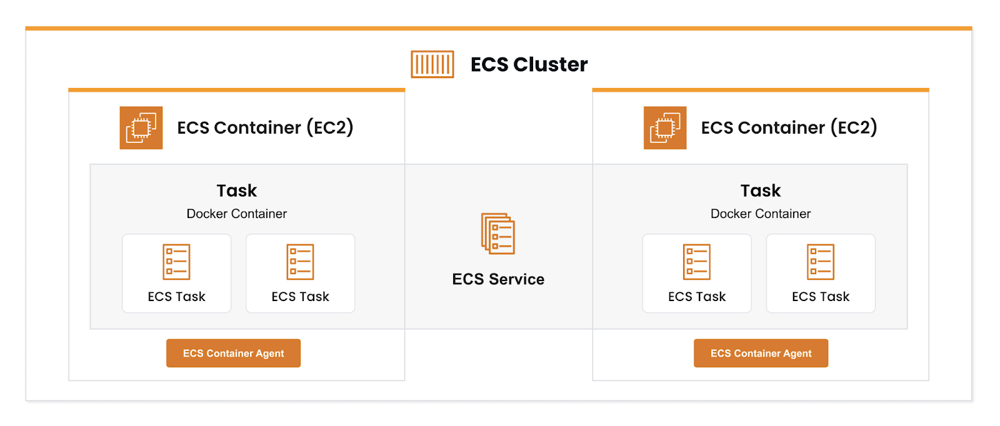

## Amazon ECS (Elastic Container Service)

- Amazon ECS is a fully managed container orchestration service by AWS that lets you easily run, manage, and scale Docker containers. It handles the deployment, management, and scaling of containerized applications using clusters of EC2 instances or serverless compute with AWS Fargate.
- A fully managed service by AWS that simplifies running and managing Docker containers on a cluster of virtual machines.

### Key Concepts:
- **Cluster**: A logical grouping of tasks or services. You can run multiple clusters in a single AWS account.
- **Task Definition**: A blueprint(abstraction) for your application. It describes one or more containers that form your application. It is a JSON file that describes the containers, their resources, and how they should run.
- **Task**: An implementation of a task definition. It runs on a cluster and can be managed by ECS.
- **Service**: A long-running task that is managed by ECS. It ensures that the desired number of tasks are running and can be scaled up or down.

### Launch Types:
- **EC2 Launch Type**: You manage the EC2 instances in your cluster. You have full control over the underlying infrastructure. You need to manually provision and manage the EC2 instances that run your containers.
- **Fargate Launch Type**: AWS manages the infrastructure for you. You only need to define your application and its requirements (like CPU and memory). Fargate automatically provisions the compute resources needed to run your containers.

### Interview Questions:
1. **EC2 VS Fargate**
   - EC2 launch type requires you to manage the EC2 instances, while Fargate is serverless and AWS manages the infrastructure for you. With Fargate, you only need to define your application and its requirements (like CPU and memory).
   - In EC2, you pay for the EC2 instances, while in Fargate, you pay for the resources (CPU and memory) that your containers use. 
   - Fargate is more cost-effective for short-lived or variable workloads, while EC2 may be more cost-effective for long-running workloads.

2. **ECS Workflow**
   - Create a cluster: A logical grouping of tasks or services. You can run multiple clusters in a single AWS account.
   - Register a task definition: A blueprint for your application. It describes one or more containers that form your application.
   - Create a service: A long-running task that is managed by ECS. It ensures that the desired number of tasks are running and can be scaled up or down.
   - Run tasks: An implementation of a task definition. It runs on a cluster and can be managed by ECS.

3. **ECS Container Agent**
   - The ECS container agent is a software automatically installed that runs on each EC2 instance in your cluster. It is responsible for managing the containers on the instance and communicating with the ECS service.
   - The agent is responsible for starting and stopping containers, reporting the status of the containers to the ECS service, and managing the lifecycle of the containers.

4. **Task vs Service**
   - A Task is a one-time execution of a containerized app.
   - A service ensures that the desired number of tasks are running and can be scaled up or down with features like load balancing and auto-recovery.

