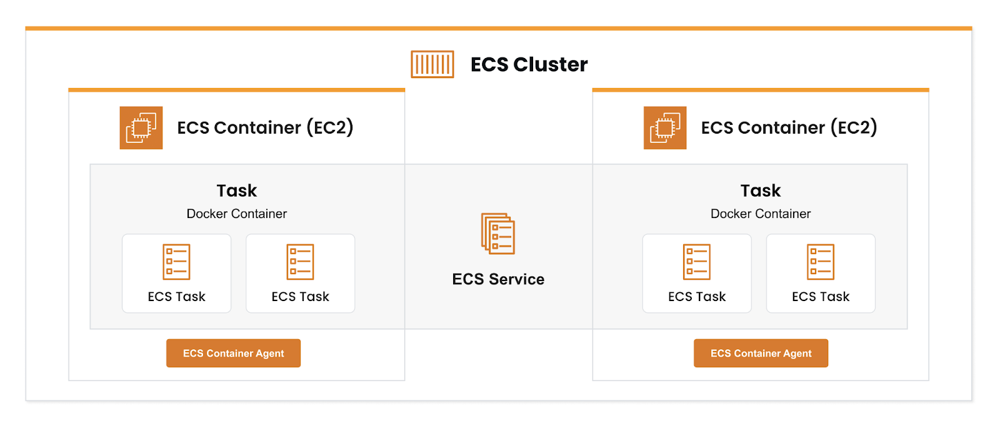

## Amazon ECS (Elastic Container Service)

Amazon ECS is a fully managed **container orchestration service** that runs, manages, and scales Docker containers on AWS — either on EC2 instances you manage or serverless via Fargate.

**Key Concepts:**
- **Cluster**: Logical grouping of tasks/services. Can use EC2, Fargate, or both.
- **Task Definition**: A JSON blueprint describing one or more containers — image, CPU, memory, port mappings, environment variables, IAM role, volumes.
- **Task**: A running instance of a task definition. Can be a one-off job or part of a service.
- **Service**: Ensures a specified number of tasks are always running. Integrates with ALB for load balancing and supports auto scaling.
- **ECS Container Agent**: Runs on each EC2 instance in the cluster to register the instance with ECS and communicates with ECS control plane to manage tasks.

**Launch Types:**

| | EC2 Launch Type | Fargate Launch Type |
|-|----------------|---------------------|
| Infrastructure | You manage EC2 instances | AWS manages compute |
| Control | Full control (instance type, OS) | No access to underlying host |
| Cost | Pay for EC2 instances & storage volumes (even idle) | Pay per task vCPU/memory used |
| Use case | Predictable workloads, GPU, custom OS | Serverless, variable workloads |

**IAM Roles:**
- **EC2 Instance Profile**: Used by the container agent on EC2 — allows to pull images(ECR), write logs(Cloudwatch), make container API calls(ECS) etc.
- **ECS Task Role**: IAM role assigned per task definition — allows the container itself to access AWS services (e.g., S3, DynamoDB).

**Storage:**
- **Ephemeral storage**: Temporary storage tied to the task lifecycle (Fargate: up to 200 GB).
- **EFS**: Mount EFS volumes for persistent shared storage across tasks (works with both EC2 and Fargate).
- **EBS**: Can be attached per task on EC2 launch type.

**Auto Scaling:**
- Auto scaling can be done based on CPU utilization, memory utilization, ALB Request Count per target(metric form ALB), or custom CloudWatch metrics.
- Types of Auto Scaling:
    - **Service Auto Scaling**: Automatically adjusts the number of tasks in a service.
    - **Cluster Auto Scaling**: Automatically adjusts the number of EC2 instances in the cluster (only for EC2 launch type).
    - **Target Tracking Scaling**: Scale based on a specific metric (e.g., keep CPU at 50%).
    - **Step Scaling**: Scale based on a specific cloudwatch alarm threshold (e.g., scale out if CPU > 70% for 5 minutes).
    - **Scheduled Scaling**: Scale based on a schedule (e.g., scale out at 9 AM, scale in at 5 PM).
- EC2 launch type auto scaling can be done by
    - **Auto Scaling Groups**: Define scaling policies to add/remove EC2 instances based on CloudWatch alarms. 
    - **ECS Cluster Capacity Providers**: ECS can manage scaling of EC2 instances in the cluster based on task demand using capacity providers and auto scaling groups.

**Integrations:**
- **Load Balancer**:
    - **ALB**: Distributes traffic across tasks using dynamic port mapping.
    - **NLB**: Only for high-performance and throughput-intensive, low-latency workloads.
    - **Classic ELB**: Not recommended for new applications, only supports static port mapping.(Not works with Fargate)
- **ECR**: Pull container images from Amazon ECR.
- **CloudWatch**: Logs and metrics from containers.
- **Auto Scaling**: Scale tasks based on CPU/memory or custom CloudWatch metrics.
