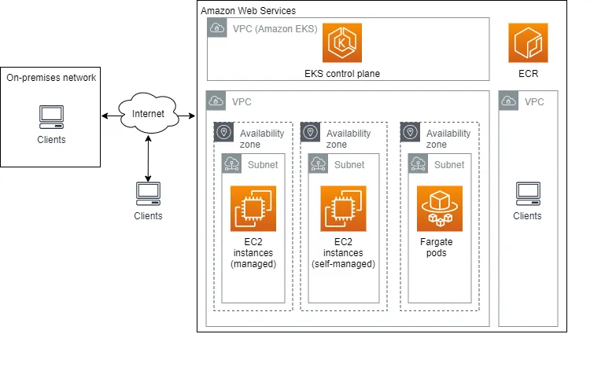

## AWS EKS(Elastic Kubernetes Service)

- AWS Elastic Kubernetes Service (EKS) is a fully managed Kubernetes service that simplifies the deployment, management, and scaling of containerized applications using Kubernetes on AWS. It eliminates the need to install, operate, and maintain Kubernetes control planes or nodes.
- EKS follows standard upstream Kubernetes, meaning you can use all native Kubernetes tools (kubectl, Helm, etc.).

### Key Features:
- **Fully Managed Control Plane**: AWS handles the Kubernetes master nodes (control plane).
- **Integration with AWS Services**: EKS integrates with other AWS services like IAM, CloudWatch, and VPC.
- **Security**: EKS provides built-in security features, including IAM roles, VPC isolation, K8S RBAC, and encryption.
- **Scalability**: EKS can automatically scale your applications based on demand using the Kubernetes Cluster Autoscaler and AWS Auto Scaling.
- **Multi-AZ Deployment**: EKS can run across multiple Availability Zones (AZs) for high availability and fault tolerance.
- **Support for Fargate**: EKS supports AWS Fargate(serverless), allowing you to run containers without managing the underlying EC2 instances.

### EKS Architecture
1. EKS consists of two main components:
  - **Control Plane**: Managed by AWS, it includes the Kubernetes API server and etcd (the key-value store for Kubernetes), Scheduler, controller-manager.
  - **Worker Nodes**: You can use EC2 instances or AWS Fargate to run your workloads. Worker node has Kubernetes components like kubelet and kube-proxy,.
2. **Networking**: EKS uses AWS VPC for networking, which is used for pod communication and service discovery. EKS supports both AWS VPC CNI plugin and third-party CNI plugins for networking.

### EKS Deployment Models
- **Self-Managed**: You manage the worker nodes (EC2 instances) and the control plane is managed by AWS.
- **Managed Node Groups**: AWS manages the worker nodes(EC2 based) for you, including scaling and updates. You define instance types and scaling.
- **Fargate**: Fully serverless. You define the CPU and memory requirements for your pods, and Fargate provisions the resources automatically.

### Interview Questions
1. **Difference between EKS and ECS?**
   - EKS is a managed Kubernetes service and K8s is open source, while ECS is AWS native container orchestration service. EKS uses Kubernetes APIs and tools, while ECS uses its own APIs and tools.
   - EKS is more flexible and supports a wider range of workloads, while ECS is simpler and more integrated with AWS services.
   - EKS is better for complex applications with multiple microservices, while ECS is better for simpler applications with fewer services.

2. **EKS vs EKS Fargate?**
   - EKS is a managed Kubernetes service that requires you to manage the worker nodes (EC2 instances or Fargate), while EKS Fargate is serverless and AWS manages the infrastructure for you.
   - With EKS, you have more control over the underlying infrastructure, while with EKS Fargate, you only need to define your application and its requirements (like CPU and memory).
   - EKS Fargate is more cost-effective for short-lived or variable workloads, while EKS may be more cost-effective for long-running workloads.

3. **How does EKS handle scaling?**
   - There are three types of auto-scaling:
   - Cluster AutoScaler (CA): Scales EC2 nodes in node groups.
   - Horizontal Pod AutoScaler (HPA): Scales pods based on CPU/memory.
   - Vertical Pod AutoScaler (VPA): Adjusts resource requests/limits per pod.

4. **How to optimize EKS costs?**
   - Use AWS Fargate for serverless workloads to avoid paying for idle EC2 instances.
   - Use Spot Instances for non-critical workloads to save costs.
   - Use AWS Savings Plans or Reserved Instances for long-running workloads to reduce costs.
   - Monitor and optimize resource requests and limits for your pods to avoid over-provisioning.

