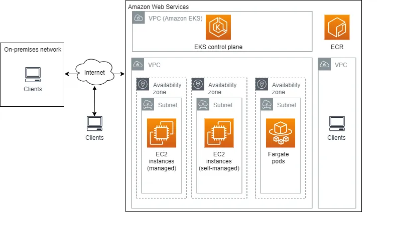

## Amazon EKS (Elastic Kubernetes Service)

Amazon EKS is a fully managed **Kubernetes** service — runs Kubernetes on AWS without needing to install or operate the control plane. Supports standard Kubernetes tools (kubectl, Helm, etc.).

**Key Concepts:**
- **Control Plane**: Fully managed by AWS — includes API server, etcd, scheduler, and controller manager. Runs across multiple AZs automatically.
- **Worker Nodes**: Run your actual workloads (pods). You manage these via node groups or Fargate.
- **Pod**: Smallest deployable unit in Kubernetes — one or more containers sharing network and storage.
- **Node Group**: A collection of EC2 instances that serve as Kubernetes worker nodes in a cluster. All instances in a node group share the same instance type, AMI, and configuration. EKS registers them automatically with the control plane so pods can be scheduled on them. These are managed by AWS Auto Scaling Groups for scaling and lifecycle management.

**Node Types:**

| Type | Description |
|------|-------------|
| **Self-Managed Nodes** | You provision and manage EC2 instances manually (Supports on-demand and spot instances) |
| **Managed Node Groups** | AWS manages EC2 lifecycle (launch, update, terminate) — you define instance type and scaling (Supports on-demand and spot instances) |
| **Fargate** | Serverless — AWS provisions compute per pod, no nodes to manage |

**Networking:**
- Uses **AWS VPC CNI plugin** — each pod gets a real VPC IP address from the subnet.
- Supports security groups at the pod level.

**IAM & Security:**
- **IRSA (IAM Roles for Service Accounts)**: Assign IAM roles directly to Kubernetes service accounts — pods get fine-grained AWS permissions without node-level credentials.
- Supports Kubernetes RBAC alongside AWS IAM for access control.

**Storage:**
- **EBS**: Block storage per pod (single AZ). Can be added via EBS CSI driver(Add-on).
- **EFS**: Shared persistent storage across pods and AZs (via CSI driver). Can be added via EFS CSI driver(Add-on).

**EKS vs ECS:**
- EKS: Kubernetes-native, more flexibility, steeper learning curve, portable across clouds.
- ECS: AWS-native, simpler to operate, tighter AWS integration, less portable.
