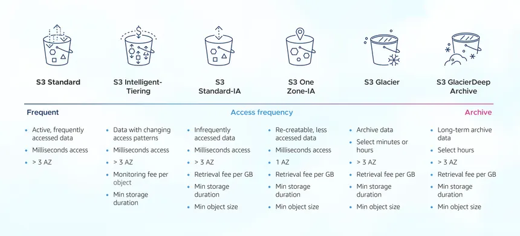
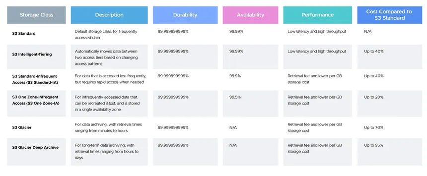

## AWS S3(Simple Storage Service)

AWS S3 is an object storage service that offers high durability, availability, scalability and highly available. It is designed to store and retrieve any amount of data from anywhere on the web. S3 is commonly used for backup, archiving, big data analytics, and content distribution.

**Key Concepts:**
- **Bucket**: A container for storing objects. Each bucket has a unique name within the AWS region.
- **Object**: The fundamental entity stored in S3, consisting of data, metadata, and a unique identifier (key). Things like images, videos, and documents are stored as objects in S3.
- **Key**: The unique identifier for an object within a bucket. It is the full path to the object, including the file name and any prefixes (folders).
- **Versioning**: A feature that allows you to keep multiple versions of an object in a bucket. This is useful for data recovery and rollback purposes.
- **Lifecycle Policies**: Rules that automate the transition of objects between storage classes or delete them after a specified period.
- **Access Control Lists (ACLs)**: A way to manage permissions for buckets and objects. ACLs define who can access the data and what actions they can perform.
- **Static website hosting**: S3 can be used to host static websites by serving HTML, CSS, and JavaScript files directly from a bucket.
- **Encryption**: S3 supports server-side encryption (SSE) to protect data at rest. You can use AWS Key Management Service (KMS) or S3-managed keys (SSE-S3) for encryption.
- **Blocked Public Access**: By default, S3 blocks public access to buckets and objects. You can configure bucket policies or ACLs to allow public access if needed.
- **Gateway Endpoints**: S3 supports VPC endpoints, allowing you to access S3 without going through the public internet through Internet Gateway. This is useful to access S3 from private subnets securely.
- **S3TA(S3 Transfer Acceleration)**: A feature that speeds up the upload and download of files from S3 bucket to clients by using Amazon CloudFront's globally distributed edge locations. It is useful for transferring large files over long distances.
- **Sample Bucket Policy**:
```json
{
  "Version": "2012-10-17",
  "Statement": [
    {
      "Effect": "Allow",
      "Principal": "*",
      "Action": "s3:GetObject",
      "Resource": "arn:aws:s3:::example-bucket/*"
    }
  ]
}
```
**Storage Classes:**
- **S3 Standard**: General-purpose storage for frequently accessed data. It offers high durability and availability.
- **S3 Intelligent-Tiering**: Automatically moves data between two access tiers (frequent and infrequent) based on usage. It is cost-effective for data with unpredictable access patterns.
- **S3 Standard-IA (Infrequent Access)**: Lower-cost storage for infrequently accessed data. It has a retrieval fee but is suitable for long-term storage.
- **S3 One Zone-IA**: Similar to Standard-IA but stored in a single availability zone. It is cheaper but less durable.
- **S3 Glacier**: Low-cost storage for archival data with retrieval times ranging from minutes to hours. It is suitable for long-term data retention.
- **S3 Glacier Deep Archive**: The lowest-cost storage class for long-term archival data. It is designed for data that is rarely accessed and has a retrieval time of 12 hours or more.
- **S3 Reduced Redundancy Storage (RRS)**: Provides lower durability than Standard but at a lower cost. It is suitable for non-critical data that can be easily reproduced.




## Pricing:
- **Storage Costs**: Charged based on the amount of data stored in S3, measured in GB per month.
- **Data Transfer Costs**: Charged based on the amount of data transferred out of S3 to the internet or other AWS regions.

- **Requests and Retrieval Costs**: Charged based on the number of requests made to S3 (PUT, GET, LIST, etc.) and the retrieval of data from different storage classes.
- **Data Transfer In Costs**: No pricing for Data Transfer In bound & between other services within same region, but Data Transfer Out is charged based on the amount of data transferred out of AWS.

## Interview Questions:
1. **Difference between Bucket policies and ACLs?**
   - Bucket policies are resource-based policies that apply to the entire bucket and its objects, while ACLs are access control lists that can be applied to individual objects or buckets. Bucket policies are more flexible and powerful than ACLs.

2. **How S3 ensures data durability?**
   - S3 ensures data durability by automatically replicating objects across multiple availability zones within a region. It uses a combination of redundancy, checksums, and versioning to protect against data loss. S3 ensures 99.999999999% (11 nines) durability for objects stored in S3 Standard.

3. **What is CRR (Cross-Region Replication) and how does it work?**
   - Cross-Region Replication (CRR) is a feature that automatically replicates objects from one S3 bucket to another bucket in a different AWS region. It is useful for disaster recovery, compliance, and data locality. CRR can be configured at the bucket level and can replicate new objects as well as existing objects.

4. **What is the maximum size of an object that can be stored in S3?**
   - The maximum size of a single object that can be stored in S3 is 5 TB. However, objects larger than 5 GB must be uploaded using the multipart upload API.

5. **How S3 handles Event Notifications?**
   - S3 can send event notifications to other AWS services (such as Lambda, SNS, or SQS) when certain events occur in a bucket, such as object creation, deletion, or restoration. This allows you to trigger workflows or processes based on S3 events.

6. **How to optimize S3 costs?**
   - Use lifecycle policies to transition infrequently accessed data to S3 Standard-IA or Glacier. Enable Intelligent-Tiering for unpredictable access patterns.
   - Use S3 Select to retrieve only the data you need from large objects. Monitor and analyze your S3 usage with AWS Cost Explorer and S3 Storage Lens. Delete unnecessary or outdated objects using lifecycle policies.
