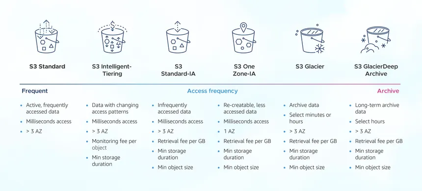
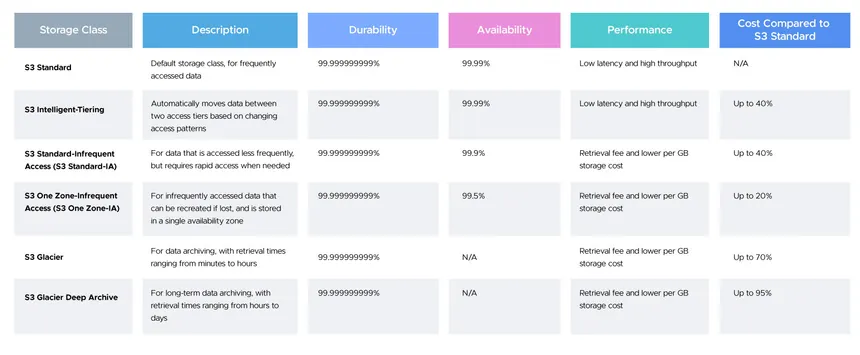

## AWS S3(Simple Storage Service)

AWS S3 is an object storage service that offers high durability, availability, scalability and highly available. It is designed to store and retrieve any amount of data from anywhere on the web. S3 is commonly used for backup, archiving, big data analytics, and content distribution.

**Key Concepts:**
- **Bucket**: A container for storing objects. Each bucket has a globally unique name across all AWS accounts. Buckets are regionally scoped, meaning they are created in a specific AWS region.
- **Object**: The fundamental entity stored in S3, consisting of data, metadata, and a unique identifier (key). Things like images, videos, and documents are stored as objects in S3.
   - **Maximum object size**: 5 TB (if above 5TB, must use multipart upload)
- **Key**: The unique identifier for an object within a bucket. It is the full path to the object, including the file name and any prefixes (folders). Key is composed of prefix and object name(example: `s3://my-bucket/prefix/object_name`). There is no concept of directories in S3, but you can use prefixes to simulate a folder like structure in UI in S3 console.
- **Metadata**: Additional information about an object, such as content type, size, and custom metadata. It is a list of key-value pairs that provide information about the object used for system and user-defined metadata.
- **Versioning**: A feature that allows you to keep multiple versions of an object in a bucket. This is useful for data recovery and rollback purposes.
   - If no versioning is enabled, the object will have a version ID of "null".
   - Suspends versioning: stops creating new versions but retains existing ones.
- **Lifecycle Policies**: Rules that automate the transition of objects between storage classes or delete them after a specified period.
- **Static website hosting**: S3 can be used to host static websites by serving HTML, CSS, and JavaScript files directly from a bucket.
- **Replication**: S3 supports replication features to automatically copy objects between buckets in the same or different regions. To enable replication, the versioning must be enabled. These operations are asynchronous. Also, must provide a proper IAM permissions. This includes:
   - **Cross-Region Replication (CRR)**: Automatically replicates objects from one bucket to another bucket in a different region. Use case: Compliance, low latency access & replication across accounts.
   - **Same-Region Replication (SRR)**: Automatically replicates objects within the same region. Use case: low aggregation, live replication between test & production accounts.
   - **Replication Time Control (RTC)**: Provides a predictable replication time for CRR and SRR.
   - **S3 Batch Replication**: After you enabled replication, only new objects are replicated. If you want to replicate existing objects, you can use S3 Batch Replication to replicate a large number of objects in a single operation. For delete, it only replicates delete markers, not objects with version ID. There is no chaining of replication(i.e. if you have a bucket A and B, and you replicate A to B, and then replicate B to C, it will not replicate A to C).
- **Security**:
   - **User Based**: IAM policies that define permissions for users and groups to access S3 resources.
   - **Resource Based**:
      - **Bucket Policies**: JSON-based policies that define permissions for a bucket and its objects. Bucket policies can grant or deny access to specific users, groups, or AWS accounts(cross account).
      - **Access Control Lists (ACLs)**: A legacy method of managing access to S3 resources. ACLs can be applied to buckets and objects to grant permissions to specific AWS accounts or groups.(can be disabled)
      - **Object Access Control Lists (ACLs)**: Similar to ACLs, but applied to individual objects. OACLs can be used to grant permissions to specific AWS accounts or groups.(less common and can be disabled)
   - **NOTE**: an IAM principal can access S3 object if,
      - IAM User Permissions allowed OR Resource Policy allowed.
      - AND There is no explicit deny in either policy.
- **Encryption**: S3 supports server-side encryption (SSE) to protect data at rest. You can use AWS Key Management Service (KMS) or S3-managed keys (SSE-S3) for encryption.
- **Gateway Endpoints**: S3 supports VPC endpoints, allowing you to access S3 without going through the public internet through Internet Gateway. This is useful to access S3 from private subnets securely.
- **Blocked Public Access**: By default, S3 blocks public access to buckets and objects(Additional layer of security). You can configure bucket policies or ACLs to allow public access if needed. Even while creating bucket you turned off block public access, it will still be blocked by default. You need to explicitly allow public access using bucket policies.
- **S3TA(S3 Transfer Acceleration)**: A feature that speeds up the upload and download of files from S3 bucket to clients by using Amazon CloudFront's globally distributed edge locations. It is useful for transferring large files over long distances.
- **Sample Bucket Policy**:
```json
{
  "Version": "2012-10-17",
  "Statement": [
    {
      "Effect": "Allow",
      "Principal": "*",
      "Action": "s3:GetObject",
      "Resource": "arn:aws:s3:::example-bucket/*"
    }
  ]
}
```
**Storage Classes:** (99.999999999%(11 9's) durability for all classes)
- **S3 Standard**: General-purpose storage for frequently accessed data. It offers high durability and availability. 99.99% availability, not available 53 minutes in a year.
   - **Use case**: Websites, content distribution, and big data analytics.
- **S3 Intelligent-Tiering**: Automatically moves data between two access tiers (frequent and infrequent) based on usage. Small monthly monitoring and auto tiering fee. No retrieval charges. The types can used:
   - **Frequent Access**(automatic): Default tier.
   - **Infrequent Access**(automatic): Not accessed for 30 days.
   - **Archive Instant Access**(automatic): Not accessed for 90 days.
   - **Archive Access**(optional): Configured from 90days to 700+ days.
   - **Archive Deep Access**(optional): Configured from 180+ days to 700+ days.
   - **Use case**: Data with unpredictable access patterns, such as machine learning data and analytics.
- **S3 Standard-IA (Infrequent Access)**: Lower-cost storage for infrequently accessed data. Data is less frequently accessed but rapid retrieval when needed. It has a retrieval fee but is suitable for long-term storage. 99.9% availability, not available 4 days in a year. 
   - **Use case**: Disaster recovery, backups, and long-term storage.
- **S3 One Zone-IA**: Similar to Standard-IA but stored in a single availability zone. It is cheaper but less durable. Data loss when AZ is destroyed. 99.5% availability, not available 18 days in a year.
   - **Use case**: Secondary backup copies of on-premises data, and data that can be easily recreated.
- **S3 Glacier**: Low-cost storage for archival data with retrieval times ranging from minutes to hours. It is suitable for long-term data retention. Pricing for storage and retrieval.
   - **S3 Glacier Instant Retrieval**: Millisecond retrieval, designed for data that is accessed frequently but stored in Glacier. Minimum 90 days storage duration.
      - **Use case**: Data that is accessed frequently but needs to be stored at a lower cost.
   - **S3 Glacier Flexible Retrieval(formerly S3 Glacier)**: Expedited (1-5 minutes), Standard (3-5 hours), and Bulk (5-12 hours) retrieval options. It is free and 90 days minimum storage duration.
      - **Use case**: Long-term archival data, backups, and compliance data.
   - **S3 Glacier Deep Archive**: Lowest-cost storage for long-term archival data. Standard(12 hours), Bulk(48 hours). 180 days minimum storage duration.

- **S3 Reduced Redundancy Storage (RRS)(Deprecated)**: Provides lower durability than Standard but at a lower cost. It is suitable for non-critical data that can be easily reproduced.




## Pricing:
- **Storage Costs**: Charged based on the amount of data stored in S3, measured in GB per month.
- **Data Transfer Costs**: Charged based on the amount of data transferred out of S3 to the internet or other AWS regions.

- **Requests and Retrieval Costs**: Charged based on the number of requests made to S3 (PUT, GET, LIST, etc.) and the retrieval of data from different storage classes.
- **Data Transfer In Costs**: No pricing for Data Transfer In bound & between other services within same region, but Data Transfer Out is charged based on the amount of data transferred out of AWS.

## Interview Questions:
1. **Difference between Bucket policies and ACLs?**
   - Bucket policies are resource-based policies that apply to the entire bucket and its objects, while ACLs are access control lists that can be applied to individual objects or buckets. Bucket policies are more flexible and powerful than ACLs.

2. **How S3 ensures data durability?**
   - S3 ensures data durability by automatically replicating objects across multiple availability zones within a region. It uses a combination of redundancy, checksums, and versioning to protect against data loss. S3 ensures 99.999999999% (11 nines) durability for objects stored in S3 Standard.

3. **What is CRR (Cross-Region Replication) and how does it work?**
   - Cross-Region Replication (CRR) is a feature that automatically replicates objects from one S3 bucket to another bucket in a different AWS region. It is useful for disaster recovery, compliance, and data locality. CRR can be configured at the bucket level and can replicate new objects as well as existing objects.

4. **What is the maximum size of an object that can be stored in S3?**
   - The maximum size of a single object that can be stored in S3 is 5 TB. However, objects larger than 5 GB must be uploaded using the multipart upload API.

5. **How S3 handles Event Notifications?**
   - S3 can send event notifications to other AWS services (such as Lambda, SNS, or SQS) when certain events occur in a bucket, such as object creation, deletion, or restoration. This allows you to trigger workflows or processes based on S3 events.

6. **How to optimize S3 costs?**
   - Use lifecycle policies to transition infrequently accessed data to S3 Standard-IA or Glacier. Enable Intelligent-Tiering for unpredictable access patterns.
   - Use S3 Select to retrieve only the data you need from large objects. Monitor and analyze your S3 usage with AWS Cost Explorer and S3 Storage Lens. Delete unnecessary or outdated objects using lifecycle policies.
