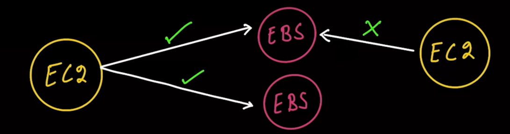
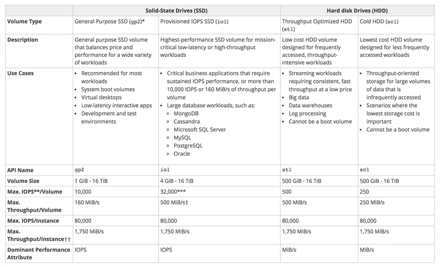

## AWS EBS (Elastic Block Store)

Amazon EBS is a block storage service designed for use with Amazon EC2 instances. It provides high-performance, durable, and scalable storage for workloads such as databases, file systems, and applications requiring low-latency access to data.
- EBS volumes behave like raw, unformatted block devices and can be mounted as file systems or used in applications (like a database). 
- One EC2 instance can have multiple EBS volumes attached to it but one EBS can be attached to only one EC2 instance at a time. Also, we can attach 1 EBS volume to multiple EC2 instances using **Multi-Attach** feature but only in the same availability zone.
- EBS are network attached(network drive), meaning they are not directly attached to the EC2 instance. Instead, they are connected over the network, allowing for flexibility and scalability.
- EC2 and EBS should be in the same region and availability zone.
- EBS volume attached to the root device of an EC2 instance is called the **root volume** and it by default has "delete on termination" enabled. This means that when the EC2 instance is terminated, the root volume is also deleted. However, you can change this setting to keep the root volume after termination if needed. Other than root volume, EBS volumes are not deleted when the EC2 instance is terminated by default. You can enable "delete on termination" manually for other EBS volumes if required.

### Key Features:
- **Durability and Availability:** EBS volumes are designed for 99.999% availability and automatically replicated within their Availability Zone to protect against hardware failures.
- **Volume Types:** EBS offers different volume types optimized for various workloads, including SSD-backed volumes for transactional workloads and HDD-backed volumes for throughput-intensive applications.
- **Encryption:** When you enable encryption, data is encrypted at rest and in transit, all data in flight is encrypted, and all snapshots are encrypted, all volumes created from the snapshot are encrypted. EBS encryption uses AWS Key Management Service (KMS) to manage encryption keys. Snapshots of non encrypted volumes are not encrypted, but you can create a snapshot of an unencrypted volume and then copy it to create an encrypted snapshot. You can also use the AWS CLI or SDKs to encrypt existing unencrypted volumes and snapshots.
- **Elasticity:** EBS volumes can be resized and modified without downtime, allowing you to adapt to changing storage needs.
- **Performance:** EBS volumes can deliver high IOPS (Input/Output Operations Per Second) and low latency, making them suitable for a wide range of applications, including databases and big data analytics.
- **Multi-Attach:** EBS volumes can be attached to multiple EC2 instances in the same Availability Zone, enabling high availability and failover scenarios. It is limited to 16 EC2 instances at a time.
- **Boot Volumes:** Only GP2 and GP3 volumes, IO1 and IO2 volumes can be used as boot volumes.

### EBS Volume Types:
- **General Purpose SSD (gp2/gp3):** Balanced price and performance for a wide range of workloads. Suitable for boot volumes, small to medium-sized databases, and development/test environments. Max IOPS is 16,000 and max throughput is 1,000 MB/s, if require more IOPS increase the size of the volume.
   - **gp3:** Newer generation of gp2 volumes. Max IOPS is 16,000 and max throughput is 1,000 MB/s.
   - **gp2:** Older generation of gp3 volumes. IOPS is based on volume size (3 IOPS per GB) and max throughput is 250 MB/s. If you need more IOPS, you need to increase the size of the volume.
- **Provisioned IOPS SSD (io1/io2):** Designed for I/O-intensive applications, such as large relational or NoSQL databases. Provides high IOPS and low latency. Max IOPS is 64,000 and max throughput is 1,000 MB/s. No need to increase the size of the volume to increase IOPS. **Provisioned IOPS** supports multi attach feature.
   - **io1:** Max IOPS is 64,000 and increase IOPS independently of volume size
   - **io2:** Max IOPS 256,000 and sub millisecond latency.
- **Throughput Optimized HDD volumes (st1):** Low-cost HDD volume designed for frequently accessed, throughput-intensive workloads. Suitable for big data, data warehouses, and log processing.
- **Cold HDD (sc1):** Lowest-cost HDD volume designed for less frequently accessed data. Suitable for large-scale data storage, such as infrequently accessed backups and archives.
- **Magnetic (standard):** Previous generation HDD volume type, now deprecated. Suitable for infrequently accessed data and workloads with lower performance requirements.

### EBS Snapshots:
- EBS allows you to create point-in-time snapshots of your volumes, which are stored in Amazon S3 and can copy across AZ/regions.
- Snapshots can be used for backup, disaster recovery, and creating new volumes. (Organizations use EBS snapshots to create AMIs and launch their software configured in the AMI). 
- To automatically create EBS snapshots, you can use **AWS Data Lifecycle Manager**. Snapshots are stored in S3 and available at the regional level rather than availability zone level like EBS.
#### The below are under EBS snapshots(not S3):
- To save EBS snapshot costs, Setup EBS snapshot archive (takes 12 to 72 hours to restore), and use EBS snapshot lifecycle policies to automate the deletion of old snapshots.
- Can also enable EBS snapshot recycle bin to recover deleted snapshots. EBS snapshot recycle bin is a feature that allows you to recover deleted EBS snapshots within a specified retention period. When you delete a snapshot, it is moved to the recycle bin instead of being permanently deleted. You can restore the snapshot from the recycle bin within the retention period(1 day to 1 year).
- Fast snapshot recoveries (FSR) is a feature that allows you to create snapshots of EBS volumes without impacting the performance of the running instance. FSR uses incremental snapshots to minimize the impact on performance and reduce the time required to create a snapshot.

### Pricing:
EBS pricing is based on 
- Volume type (SSD or HDD)
- Provisioned storage size (in GB)
- IOPS (for provisioned IOPS volumes)
- Data transfer (for snapshots and data transfer between regions)
- Snapshot storage (for EBS snapshots stored in S3)

#### Use Cases:
- **Database Storage:** EBS is commonly used for databases, providing low-latency access to data and high IOPS for transactional workloads.
- **File Systems:** EBS can be used to create file systems for applications that require persistent storage, such as web servers and application servers.
- **Backup and Disaster Recovery:** EBS snapshots can be used for backup and disaster recovery, allowing you to create point-in-time copies of your data.
- **Big Data Analytics:** EBS can be used for big data analytics workloads, providing high throughput and low latency for data processing.

### Interview Questions:
1. **Difference between gp2 and gp3 EBS volumes?**
   - gp2 volumes are designed for general-purpose workloads, while gp3 volumes offer better performance and cost savings. gp3 allows you to provision IOPS and throughput independently of storage size, making it more flexible and cost-effective.

2. **Difference between io1 and io2 EBS volumes?**
   - io1 volumes are designed for I/O-intensive applications, while io2 volumes provide higher durability and performance. io2 volumes can deliver up to 64,000 IOPS and 1,000 MB/s throughput, making them suitable for mission-critical applications.

3. **Can you create EC2 of storage type other than gp or io?**
   - No, you can only create EC2 instances with gp or io storage types. Other storage types (st1, sc1) are not supported for EC2 instances.