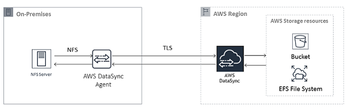

## AWS DataSync
AWS DataSync is a data transfer service that simplifies, automates, and accelerates the movement of data between on-premises storage systems, AWS storage services, and even between AWS Regions. It is designed for large-scale data migrations, ongoing data transfers, and replication tasks.
- It supports transferring of data between AWS Regions, Accounts, on-premises storage, and AWS storage services like Amazon S3, Amazon EFS, and Amazon FSx.
- It can be used for data migration, backup, archiving, and disaster recovery.

## Key Concepts:
- **DataSync**: A fully managed service that automates moving data between on-premises storage and AWS storage services.
- **Location**: A source or destination for data transfer. Locations can be on-premises storage systems, AWS services like Amazon S3, Amazon EFS, or Amazon FSx.
- **Task**: A configuration that defines the source and destination locations, as well as the data transfer settings like what to transfer and where to transfer it.
- **Agent**: A virtual machine that runs on-premises and connects your on-premises storage to AWS DataSync. It handles the data transfer process.

## Use Cases:
- **Data Migration**
- **Backup and Archiving**
- **Disaster Recovery**

## Interview Questions:
1. **Difference between AWS DataSync and Storage Gateway?**
   - AWS DataSync is primarily used for transferring large amounts of data between on-premises storage and AWS, while Storage Gateway provides a hybrid cloud storage solution that connects on-premises environments with cloud storage.
    - DataSync is more focused on data transfer, while Storage Gateway provides caching and local access to cloud storage.

2. **What are the different types of locations in DataSync?**
   - On-premises storage systems (NFS, SMB)
   - AWS services (Amazon S3, Amazon EFS, Amazon FSx)
    - Other AWS accounts or Regions

