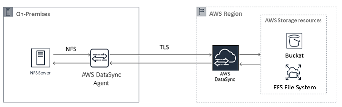

## AWS DataSync

AWS DataSync is a fully managed data transfer service that automates and accelerates moving large amounts of data between **on-premises storage**, **other cloud providers**, and **AWS storage services**.

**Key Concepts:**
- **Agent**: A lightweight VM installed on-premises (or in another cloud) that connects your source storage to DataSync. Not needed for transfers between AWS services.
- **Task**: Defines the source location, destination location, and transfer settings (what to sync, scheduling, bandwidth limits).
- **Location**: Source or destination — supports NFS, SMB, HDFS, object storage, S3, EFS, FSx, and more.

**Supported Transfers:**
- On-premises / other cloud → S3, EFS, FSx (via DataSync Agent).
- AWS service → AWS service (e.g., S3 → EFS, EFS → FSx) — no agent needed.

**Features:**
- Transfers data over the internet or **AWS Direct Connect**.
- Automatic encryption in-transit (TLS) and integrity verification.
- Supports **scheduling** for recurring sync jobs. Backup doesn't be automatic.
- Can preserve file metadata and permissions during transfer.
- Much faster than traditional tools — uses parallel, multi-threaded transfers.
- **SnowCone integration** for offline data transfer when network connectivity is limited. It comes with Agent pre-installed.

**Use cases:** One-time data migration, ongoing replication, backup to S3/Glacier, cross-region or cross-account transfers.

