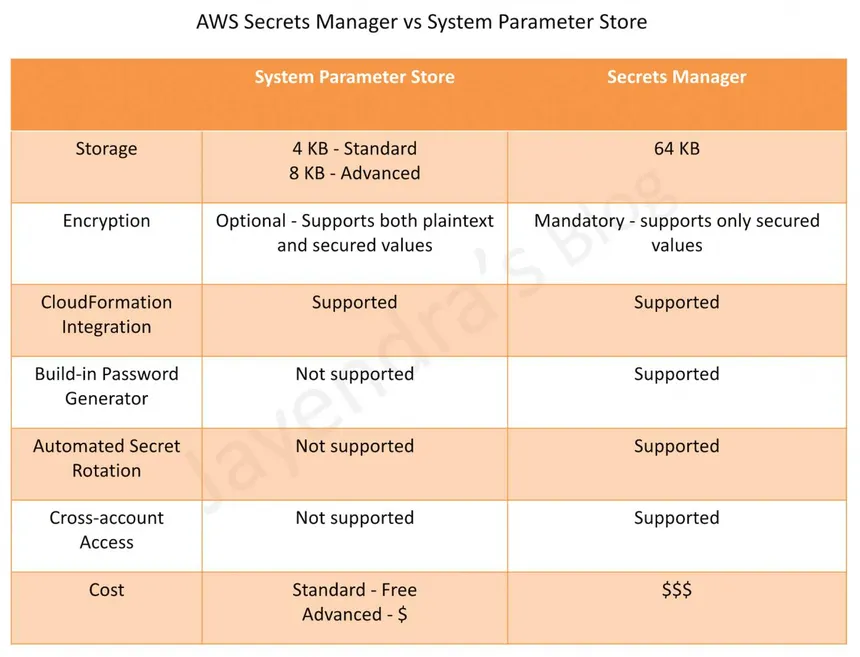

## AWS Secrets Manager

AWS Secrets Manager securely stores and manages sensitive information like **database credentials, API keys, and passwords**, with built-in automatic rotation.

**Key Concepts:**
- Secrets are encrypted at rest using **KMS**.
- **Automatic Rotation**: Natively rotates secrets for RDS, Redshift, DocumentDB on a schedule using Lambda — no app changes needed.
- Applications retrieve secrets at runtime via SDK/API — no hardcoding credentials.
- Supports cross-account access via resource-based policies.
- Charged per secret stored per month + per API call.

**Secrets Manager vs Parameter Store:**
- Secrets Manager: automatic rotation, higher cost, purpose-built for secrets.
- Parameter Store: cheaper, supports plain config + secrets, no automatic rotation.

