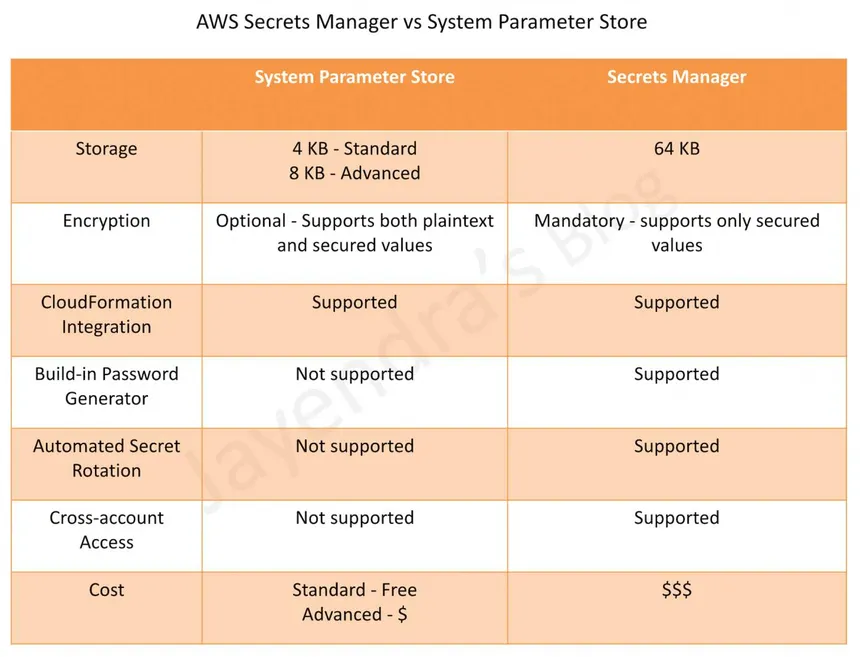

## AWS Monitoring and Management Services

AWS Monitoring & Management tools help you monitor the health, performance, and security of your AWS resources. These tools provide insights into resource utilization, real-time metrics, enable automated responses to events, and ensure compliance with best practices.

### AWS Monitoring & Management Services:
1. **Amazon CloudWatch**
2. **AWS CloudTrail**
3. **AWS Config**
4. **AWS Systems Manager**
5. **AWS Trusted Advisor**
6. **AWS Cloud Formation**
7. **AWS Service Health Dashboard**
8. **AWS Personal Health Dashboard**
9. **AWS SNS (Simple Notification Service)**
10. **AWS SQS (Simple Queue Service)**
11. **AWS Service Health Dashboard**
12. **AWS Personal Health Dashboard**
13, **AWS OpsWorks**
14. **AWS Outposts**

1. **Amazon CloudWatch**: Amazon CloudWatch is a monitoring and observability service that provides data and insights into your AWS resources and applications. It collects and tracks metrics, collects log files, sets alarms, and automatically reacts to changes in your AWS resources.
    - **Key Features**:
        - Real-time monitoring
        - Customizable dashboards
        - Alarms and notifications
        - Integration with other AWS services
        - Logs and events management
2. **AWS CloudTrail**: AWS CloudTrail is a service that enables governance, compliance, and operational and risk auditing of your AWS account. It records AWS API calls for your account and delivers log files to an Amazon S3 bucket.
    - **Key Features**:
        - Event history of AWS API calls
        - Integration with Amazon S3 and CloudWatch Logs
        - Data events monitoring
        - Insights into user activity
3. **AWS Config**: AWS Config is a service that enables you to assess, audit, and evaluate the configurations of your AWS resources. It continuously monitors and records your AWS resource configurations and allows you to automate the evaluation of recorded configurations against desired configurations.
    - **Key Features**:
        - Continuous monitoring of resource configurations
        - Compliance auditing
        - Change management
        - Integration with AWS Lambda for remediation
4. **AWS Systems Manager**: AWS Systems Manager is a management service that helps you automatically apply OS patches, collect software inventory, and configure your AWS resources at scale. It provides a unified interface to manage your AWS resources and automate tasks across your AWS infrastructure.
    - **Key Features**:
        - Centralized management of AWS resources
        - Automation of operational tasks
        - Patch management
        - Inventory collection and compliance reporting
5. **AWS Trusted Advisor**: AWS Trusted Advisor is an online resource that helps you reduce cost, increase performance, and improve security by optimizing your AWS environment. It provides real-time guidance to help you provision your resources following AWS best practices.
6. **AWS CloudFormation**: AWS CloudFormation is a service that helps you model and set up your Amazon Web Services resources so that you can spend less time managing those resources and more time focusing on your applications. You can use CloudFormation to create and update a collection of related AWS resources, provisioning and updating them in an orderly and predictable fashion.
    - **Key Features**:
        - Infrastructure as code (IaC)
        - Template-based resource provisioning
        - Stack management
        - Change sets for previewing changes
7. **AWS Service Health Dashboard**: The AWS Service Health Dashboard provides up-to-date information about the status of AWS services. It displays the current status of AWS services and any ongoing issues or outages.
    - **Key Features**:
        - Real-time service status
        - Historical data on service availability
        - Notifications for service events
        - Integration with AWS Personal Health Dashboard
8. **AWS Personal Health Dashboard**: The AWS Personal Health Dashboard provides alerts and remediation guidance when AWS is experiencing events that may impact your AWS resources. It provides a personalized view into the performance and availability of the AWS services underlying your AWS resources.
    - **Key Features**:
        - Personalized alerts and notifications
        - Event history and remediation guidance
        - Integration with AWS CloudWatch Events
        - Service health events specific to your account
9. **AWS SNS (Simple Notification Service)**: Amazon Simple Notification Service (SNS) is a fully managed messaging service that enables you to decouple and scale microservices, distributed systems, and serverless applications. It provides a simple way to send notifications from the cloud to multiple subscribers.
    - **Key Features**:
        - Multiple protocols (email, SMS, HTTP/S, etc.)
        - Integration with AWS Lambda and other AWS services
        - Message filtering and fan-out capabilities
10. **AWS SQS (Simple Queue Service)**: Amazon Simple Queue Service (SQS) is a fully managed message queuing service that enables you to decouple and scale microservices, distributed systems, and serverless applications. It allows you to send, store, and receive messages between software components at any volume without losing messages.
    - **Key Features**:
        - Fully managed message queuing
        - FIFO (First-In-First-Out) and Standard queues
        - Integration with AWS Lambda and other AWS services
        - Dead-letter queues for error handling 
11. **AWS Service Health Dashboard**: The AWS Service Health Dashboard provides up-to-date information about the status of AWS services. It displays the current status of AWS services and any ongoing issues or outages.(gives insights of all AWS services)
    - **Key Features**:
        - Real-time service status
        - Historical data on service availability
        - Notifications for service events
        - Integration with AWS Personal Health Dashboard
12. **AWS Personal Health Dashboard**: The AWS Personal Health Dashboard provides alerts and remediation guidance when AWS is experiencing events that may impact your AWS resources. It provides a personalized view into the performance and availability of the AWS services underlying your AWS resources.(gives insights of your AWS resources)
13. **AWS OpsWorks**: AWS OpsWorks is a **configuration management service** that helps you configure and operate applications in a cloud enterprise by using Chef and Puppet. It allows you to automate how nodes are configured, deployed, and managed, whether they are Amazon EC2 instances or on-premises devices.
    - **Key Features**:
        - Configuration management with Chef (automate management, configuration, security & CD) and Puppet(automate deployment, configuration, management of applications)
        - Application lifecycle management
        - Integration with AWS services(e.g., EC2, RDS)
        - Support for custom cookbooks and recipes
14. **AWS Outposts**: AWS Outposts is a fully managed service that extends AWS infrastructure, services, APIs, and tools to virtually any customer site for a truly consistent hybrid experience. It allows you to run AWS services on-premises and seamlessly integrate with the rest of your AWS environment to experience hybrid cloud solutions.
    - **Key Features**:
        - Fully managed service on-premises
        - Consistent hybrid experience
        - Integration with AWS services and APIs
        - Support for low-latency applications
        
### AWS data management services:
1. **Amazon Key Management Service (KMS)**
2. **AWS Secrets Manager**
3. **AWS Parameter Store**

1. **AWS KMS**: AWS Key Management Service (KMS) is a managed encryption service that makes it easy to create and control the keys used to encrypt your data. It provides a centralized way to manage encryption keys and integrates with other AWS services to help you protect your data at rest and in transit.
    - **Key Features**:
        - Centralized key management
        - Integrated with AWS services
        - Fine-grained access control
        - Audit and compliance capabilities

2. **AWS Secrets Manager**: AWS Secrets Manager is a service that helps you protect access to your applications, services, and IT resources without the upfront investment and on-going maintenance costs of operating your own infrastructure. It enables you to rotate, manage, and retrieve database credentials, API keys, and other secrets throughout their lifecycle.
    - **Key Features**:
        - Automatic secret rotation
        - Secure and scalable
        - used to store and manage sensitive information
        - Audit and compliance capabilities

3. **AWS Parameter Store**: AWS Systems Manager Parameter Store is a secure storage for configuration data management and secrets management. It provides a centralized store to manage your configuration data, whether plain-text data such as database strings or secrets such as passwords.
    - **Key Features**:
        - Versioning and history but not automatic rotation
        - Integration with AWS services
        - used to store configuration data and secrets
        - Fine-grained access control

